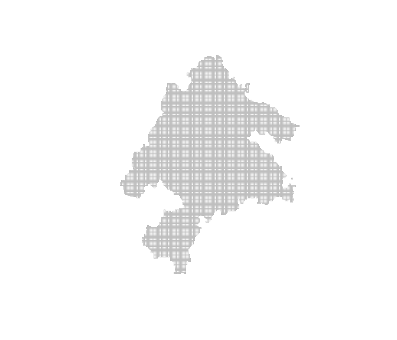

<!-- README.md is generated from README.Rmd. Please edit that file -->

# Multi-action, multi-objective spatial planning in R 

<!-- badges: start -->

[](https://CRAN.R-project.org/package=multiscape)
[](https://cran.r-project.org/package=multiscape)
[](https://lifecycle.r-lib.org/articles/stages.html)
[](https://github.com/josesalgr/multiscape/actions/workflows/R-CMD-check.yaml)
[](https://app.codecov.io/gh/josesalgr/multiscape)
<!-- badges: end -->

`multiscape` is an exact optimisation framework for **multi-action,
multi-objective spatial planning in R**. It is designed for problems in
which decisions involve allocating alternative management actions across
planning units while balancing multiple competing objectives. Building
on the transition from place-based prioritisation towards spatially
explicit action planning ([Tallis et al.,
2021](https://doi.org/10.1111/nyas.14651); [Salgado-Rojas et al.,
2023](https://doi.org/10.1111/2041-210X.14220)), `multiscape` represents
explicitly **what can be done, where it can be done, and what
consequences those actions are expected to produce**.

Users define feasible management actions, their costs, and their
expected effects on ecological or socioeconomic features relative to a
reference scenario. These action-based decisions are represented as
mixed-integer linear programming (MILP) models together with targets,
budgets, spatial requirements, locked decisions, and other constraints.
Multiple objectives, including cost, signed effects, profit, and
fragmentation, can be registered independently and explored using
weighted-sum, epsilon-constraint, and AUGMECON methods. This formulation
also provides a basis for multiple-use spatial planning, where
alternative actions and uses may need to be evaluated against competing
ecological, economic, and social objectives ([Neubert et al.,
2025](https://doi.org/10.1016/j.tree.2025.09.007)).

## Installation

Install the stable version from [Comprehensive R Archive Network
(CRAN)](https://cran.r-project.org/):

``` r
install.packages("multiscape")
```

Or install the latest development version from
[GitHub](https://github.com/josesalgr/multiscape):

``` r
if (!requireNamespace("remotes", quietly = TRUE)) {
  install.packages("remotes")
}
remotes::install_github("josesalgr/multiscape")
```

## Getting started

### Multi-action planning in the Meseta Iberica

We illustrate the `multiscape` workflow using a landscape-planning
problem from the Meseta Iberica associated with [Cánibe Iglesias et
al. (2025)](https://doi.org/10.1016/j.ecoser.2025.101742). The bundled
dataset contains **11,109 planning units**, **151 species**, four
ecosystem-service features, and four alternative management strategies:
**Afforestation**, **BAU**, **FarmReturn**, and **Firesmart**.

The original planning problem evaluates how these alternative management
strategies can be distributed across the landscape while satisfying
biodiversity and ecosystem-service requirements. Here, we use an earlier
version of those inputs to illustrate the `multiscape` formulation; the
final published analysis used 207 species.

The planning question is:

> **Where should alternative management actions be implemented to meet
> biodiversity and ecosystem-service requirements at low cost while
> maintaining spatially cohesive management patterns?**

In `multiscape`, each of the 11,109 spatial units is represented once,
and the four management strategies are treated explicitly as alternative
**actions** that can be assigned to those units. For this introductory
example, at most one action can be selected in each planning unit.

`load_meseta()` loads all the prepared inputs into a single named list.
It does not create a planning problem or choose any actions. We call
that list `meseta`; its components are accessed with `$`, for example
`meseta$planning_units`.

``` r
library(multiscape)

meseta <- load_meseta()

data.frame(
  planning_units = nrow(meseta$planning_units),
  features = nrow(meseta$features),
  actions = nrow(meseta$actions)
)
#>   planning_units features actions
#> 1          11109      155       4

meseta$actions
#>   id          name
#> 1  1 Afforestation
#> 2  2           BAU
#> 3  3    FarmReturn
#> 4  4     Firesmart
```

The first output reports the size of the example: 11,109 planning units,
155 features and four actions. `meseta$actions` shows the strategy
identifiers and names. The planning units are an `sf` object: each row
stores a spatial cell and its attributes, including its geometry. We can
draw those geometries before building the optimisation problem.

``` r
plot(
  sf::st_geometry(meseta$planning_units),
  border = "grey75",
  col = "grey95",
  lwd = 0.15,
  axes = FALSE
)
```



The same list contains all the inputs we will use in the following
stages:

| Input | What it describes |
|----|----|
| `planning_units` | Spatial cells as an `sf` object, with identifiers, attributes and geometries |
| `features` | A catalogue of the 151 species and four ecosystem-service features |
| `dist_features` | Reference representation credited to each unit and feature |
| `actions` | The four original strategy identifiers and names |
| `action_costs` | Implementation cost for each unit and strategy |
| `outcomes` | Expected representation for each cell, strategy and feature |
| `targets` | Required absolute representation of each feature |
| `boundary` | Weighted edges connecting neighbouring cells |
| `provenance` | Data sources and preparation notes |

``` r
head(meseta$action_costs)
head(meseta$outcomes)
head(meseta$targets)
```

In this example, outcomes are binary: 1 credits one unit of
representation and 0 credits none. Missing occurrence rows are treated
as zero, and the service features retain the archive’s binary coding.
Costs are selection penalties in the supplied units. These definitions
are important when interpreting both the targets and the results.

The workflow is **load the inputs → create the reference problem → add
actions and effects → set constraints and objectives → configure and
solve → compare plans**. We will build an R object called `problem` one
stage at a time.

### Stage 1: Create the base problem

`create_problem()` establishes the planning units, the feature catalogue
and the **reference amounts**. A feature is something we want to
represent, such as a species or an ecosystem service. Its reference
amount is the value against which an action’s outcome will be compared.

The reference is the **scenario you choose for that comparison**. It can
be current conditions, a future without the proposed action,
continuation of existing management, or another explicitly defined
alternative. Reference and action outcomes must describe the same
feature and location in comparable units. When comparing future
scenarios, use the same planning horizon for both. The reference
therefore need not be the condition just before management.

For example, habitat amount might be 100 today, 70 under future business
as usual (BAU), and 90 with restoration at that same future date.
Relative to future BAU, restoration changes habitat by $90-70=20$;
relative to today, the change is $90-100=-10$, which instead measures
change from the present. Choosing the reference determines which
comparison those numbers describe. [Tallis et
al. (2021)](https://doi.org/10.1111/nyas.14651) use BAU conditions to
assess action impacts, illustrating how the reference can capture
improvements over an expected alternative, including avoided losses.

For the Meseta representation example, `dist_features` supplies an
explicit **zero credited reference**. Representation is credited through
the selected strategies. This is an accounting convention for the
tutorial; it does not imply that an unmanaged landscape has no
biodiversity. The action called BAU is one of the four selectable
strategies, and its name does not set the reference automatically.

The constructor receives:

- `pu`: the spatial cells and their attributes;
- `features`: the catalogue of what we are planning for;
- `dist_features`: reference amounts, supplied through the `pu`,
  `feature` and `amount` columns; and
- `cost`: the column containing planning-unit costs.

We set planning-unit costs to zero because stage 2 will attach the
supplied costs to the individual strategies. This makes the objective
charge for the chosen action. Targets are added separately in stage 3;
they describe what a plan must achieve, rather than the scenario used
for comparison.

``` r
pu <- meseta$planning_units
pu$cost <- 0

problem <- create_problem(
  pu = pu,
  features = meseta$features,
  dist_features = meseta$dist_features,
  cost = "cost"
)
```

The returned object is called `problem`; `create_problem()` is the
function that creates it. At this stage, it holds the base inputs. With
a zero reference, the constructor may warn that features have no
positive reference amounts. The next stage supplies their representation
under each action.

Creating the base problem does not yet specify which strategies to
choose. Actions describe the available decisions; effects describe what
those decisions produce; constraints state what a feasible plan must
achieve.

### Stage 2: Define actions and their effects

An **action** is a management choice the solver can select in a planning
unit. Here, the four actions are Afforestation, BAU, FarmReturn and
Firesmart. `add_actions()` registers these choices and their costs; it
does not select them. The solver will choose where to apply them after
we finish defining the problem.

The supplied tables identify strategies with numbers. We use their
readable names as action identifiers in the problem and maps.
`strategy_names` translates the original identifiers into those names;
the same translation is applied to the cost table below and the outcome
table afterwards.

``` r
strategy_names <- setNames(meseta$actions$name, meseta$actions$id)
actions <- data.frame(id = meseta$actions$name)

costs <- meseta$action_costs
costs$action <- unname(strategy_names[as.character(costs$action)])

problem <- add_actions(problem, actions = actions, cost = costs)
```

#### How does an action change the reference?

`add_effects()` tells the model how each action changes each feature in
a cell. You can supply a final amount, an absolute change, or a
proportional change. The function converts them into a common
representation relative to the reference.

For one cell and feature, let $r$ be the reference amount, $y$ the
amount under the action scenario, and $\Delta = y-r$ the signed absolute
change. Supply **one** of these three columns:

| Column | What you supply | Amount after the action | Absolute change |
|----|----|----|----|
| `outcome` | The final amount $y$ | $y = \text{outcome}$ | $\Delta = \text{outcome} - r$ |
| `effect` | The absolute change $\Delta$ | $y = r + \text{effect}$ | $\Delta = \text{effect}$ |
| `relative_change` | The proportional change $q$ | $y = r(1+q)$ | $\Delta = rq$ |

For a reference of **100**, these three separate inputs all produce
**130**:

``` r
# Three alternative ways to describe the SAME result; use one of them.
data.frame(pu = 1, action = "restore", feature = "habitat", outcome = 130)
data.frame(pu = 1, action = "restore", feature = "habitat", effect = 30)
data.frame(pu = 1, action = "restore", feature = "habitat", relative_change = 0.30)
```

`relative_change = 0.30` means an increase of 30%, not an increase of 30
units. A decrease from 100 to 80 could instead be written as
`outcome = 80`, `effect = -20`, or `relative_change = -0.20`. Reference
and final amounts share units; a proportional change is dimensionless.
Use exactly one of the three columns in the effects table, rather than
mixing them.

If the reference is **zero**, a proportional change still gives zero:
$0(1+q)=0$. Use an absolute outcome or effect to describe a positive
amount from a zero reference. That is why this case uses `outcome`: an
outcome of 1 means one unit of credited representation under the
selected strategy. With the zero credited reference, `outcome` and
`effect` have the same numerical value here. We use `outcome` because
the supplied tables describe representation under each strategy.

``` r
outcomes <- meseta$outcomes
outcomes$action <- unname(strategy_names[as.character(outcomes$action)])

problem <- add_effects(problem, effects = outcomes)
```

### Stage 3: Define the constraints

A **constraint** specifies a requirement that every feasible plan must
meet. We add two kinds:

- **At most one strategy per cell.** `count = 1` sets the limit and
  `sense = "max"` makes it an upper bound. A cell can remain unselected.
- **A representation target for every feature.** Each supplied `target`
  is a minimum total amount, summed across the chosen strategies. For
  example, a target of 100 requires at least 100 units of credited
  representation.

These are absolute targets in the outcome units. Fractional thresholds
are retained: a binary total must reach or exceed the supplied value.

``` r
problem <- problem |>
  add_constraint_action_cardinality(
    count = 1, sense = "max", name = "one_strategy_per_cell"
  ) |>
  add_constraint_targets_absolute(meseta$targets)
```

### Stage 4: Define the objectives

Constraints decide whether a plan is feasible. **Objectives** decide
which feasible plans the solver should prefer. Here we want to minimize
two quantities:

- **Cost:** the supplied costs of the selected strategies.
- **Spatial fragmentation:** weighted edges across which selection of a
  given strategy changes between selected and unselected.

We register each objective with a readable `alias`: `"cost"` and
`"spatial"`. These names identify the objectives when configuring the
method and reading results. Both refer to the same selected actions. The
next section will explain how to combine them for one optimisation run.

``` r
problem <- problem |>
  add_spatial_relations(meseta$boundary, name = "boundary") |>
  add_objective_min_cost(include_pu_cost = FALSE, alias = "cost") |>
  add_objective_min_fragmentation_action(
    relation_name = "boundary", alias = "spatial"
  )
```

For each strategy, an edge contributes when it is selected on one side
and not the other. Adjacent cells with the same strategy contribute
nothing along their shared edge for that strategy. If two neighbours
have different strategies, the edge contributes to both strategies’
boundaries. Minimizing this sum encourages contiguous patches of each
action; it does not require all actions to form one connected area.

The supplied `boundary` table retains the original edge weights and
excludes self-pairs. We use it directly so the spatial criterion stays
the same across all runs.

### Configure the optimisation method

The **method** tells the solver how to handle the registered objectives.
For the first plan, a weighted sum minimizes:

$$\text{cost} + 0.5 \times \text{spatial fragmentation}.$$

One extra unit of fragmentation therefore adds 0.5 units to this
combined criterion. We keep the original units by disabling weight
normalization and objective scaling. `set_runs_manual()` supplies a
table with one row per run; this first table has one row and therefore
requests one plan.

``` r
# Keep the formulation before choosing an optimisation method.
action_problem <- problem
problem <- set_method_weighted_sum(
  problem,
  aliases = c("cost", "spatial"),
  runs = set_runs_manual(data.frame(weight_cost = 1, weight_spatial = 0.5)),
  normalize_weights = FALSE,
  objective_scaling = FALSE
)
```

The coefficient 0.5 is an illustrative preference for spatial cohesion,
following the source workflow. Species and ecosystem services enter
through the target constraints: every feasible plan must satisfy them.
Cost and fragmentation are the quantities being minimized.

We saved `action_problem` before adding a method so we can reuse the
same formulation later with a different table of runs.

### Solve the problem

The **solver** is the optimisation engine that searches for a feasible
plan and improves its objective value. This example uses Gurobi, which
requires an installation and valid licence. We allow two threads, up to
five minutes of solver time, and a 2% relative optimality gap. The large
dataset also requires time and memory for model preparation before the
solver starts.

``` r
problem <- set_solver_gurobi(
  problem,
  gap_limit = 0.02, time_limit = 300, cores = 2,
  solver_params = list(Method = 2, NodefileStart = 0.5),
  verbose = TRUE
)
solutions <- solve(problem)
```

The gap measures the remaining difference between the best feasible
objective and the solver’s bound. A 2% stopping tolerance does not prove
the exact optimum or a unique spatial plan. Check the returned status
and gap before interpreting the solution.

## Interpret the solutions

### Link the run to its stored solution

`get_runs()` connects the requested run to the retained solution, and
reports solver status, runtime and gap. `get_objectives()` returns the
two components in their original units. The weighted scalar value can be
reconstructed from these columns.

``` r
get_runs(solutions)
performance <- get_objectives(solutions, format = "wide")
performance$scalar_objective <- performance$cost + 0.5 * performance$spatial
performance
```

`solutions` stores the retained spatial plan together with its results.
Use the values returned by your own run: solver versions and stopping
tolerances can produce different feasible plans from the same inputs.

### Check target achievement

Objectives answer how costly or fragmented the plan is. Targets answer
whether it meets the ecological requirements. Inspect their achieved
amounts separately.

``` r
target_achievement <- get_targets(solutions)
head(target_achievement)
all(target_achievement$met)
```

The final line checks every row: `TRUE` means that all reported targets
were met. The table also shows required and achieved amounts for each
feature. Inspect this separately from cost and fragmentation, and first
check the solver status to confirm that a feasible solution was
returned.

### Decision space: where are the strategies selected?

Map the selected strategies to see what the plan prescribes in each
cell. Each strategy has its own map; a blank cell means that strategy
was not selected there, although another strategy may have been selected
in that cell. Because at most one strategy is allowed per cell, these
maps describe alternative spatial assignments rather than overlapping
action bundles.

``` r
plot_spatial_actions(
  solutions, solutions = 1, actions = actions$id, layout = "facet", ncol = 2
)
```

The maps and objective values answer complementary questions: where to
act, and how costly or fragmented the resulting plan is. The article’s
maps summarize ten replicates with different final inputs and scenarios;
the tutorial first inspects one plan and then explores alternatives from
the available earlier dataset.

### An executed example

The following maps show six solved plans for the bundled inputs, using
spatial weights 0, 0.1, 0.25, 0.5, 1 and 2. Each plan meets all 155
targets. The colours identify Afforestation (yellow), BAU (green),
FarmReturn (blue), and Firesmart (brown); grey cells have no selected
action.

<figure>

<figcaption aria-hidden="true">Six action maps across spatial
weights</figcaption>
</figure>

Read the panels from weight 0 to weight 2 to see how the spatial
preference changes the allocation. The next section shows how to request
these six runs and compare their performance. These panels are solved
plans for the bundled data; the article’s maps summarize a different,
ten-replicate analysis.

### Objective space: explore the spatial-cost trade-off

Once the original single run is understood, a separate planning question
is how much extra cost greater cohesion requires. Keep the data and
targets fixed and vary the spatial coefficient. Start from
`action_problem`, saved before the method was configured. Each problem
accepts one method definition, so we configure this exploration from
that shared formulation. The six rows below request six weighted runs
with identical data, actions, constraints and objectives.

``` r
spatial_exploration <- set_method_weighted_sum(
  action_problem,
  aliases = c("cost", "spatial"),
  runs = set_runs_manual(data.frame(
    weight_cost = rep(1, 6),
    weight_spatial = c(0, 0.1, 0.25, 0.5, 1, 2)
  )),
  normalize_weights = FALSE,
  objective_scaling = FALSE
)
spatial_exploration <- set_solver_gurobi(
  spatial_exploration, gap_limit = 0.02, time_limit = 300, cores = 2,
  solver_params = list(Method = 2, NodefileStart = 0.5), verbose = TRUE
)
alternatives <- solve(spatial_exploration)
get_runs(alternatives)
plot_tradeoff(
  alternatives, objectives = c("cost", "spatial"),
  connect = FALSE, label_runs = TRUE
)
```

Both components are minimized, so lower values on either axis are
preferable. Weight 0 focuses entirely on cost. Larger spatial weights
give the solver a stronger incentive to accept extra cost when it
reduces fragmentation. Six weighted runs sample this trade-off; they do
not establish the complete frontier. This extension is a sensitivity
analysis, not a replication of the article’s climate scenarios or its
ten stochastic replicates.

### An observed trade-off

<figure>

<figcaption aria-hidden="true">Cost versus action
fragmentation</figcaption>
</figure>

Both objectives are minimized. In the six audited plans above, moving
from weight 0 to weight 2 increases cost by approximately 16% and
reduces action fragmentation by approximately 95%. These runs sample the
trade-off rather than proving its complete Pareto frontier. Solution 5
improves both objective values of solution 4, which remains in the
sample because of finite stopping gaps; frontier diagnostics use the
observed non-dominated set.

### Compare spatial similarity and recurrent assignments

For a set of alternatives, objective values show performance, while
decision analysis shows whether that performance requires different
actions in space. Jaccard similarity measures overlap in selected
cell-action pairs. A value of 1 means identical selected assignments; 0
means no shared assignments. Two plans can have similar costs while
prescribing different actions in many cells.

``` r
selection_similarity(alternatives, metric = "jaccard", format = "matrix")
action_frequency <- selection_frequency(alternatives)
head(action_frequency[order(-action_frequency$frequency), ], 10)
```

Frequency measures how often a particular cell-action assignment recurs
across the retained alternatives. Read it as recurrence within this
exploration; it is not a selection probability for the article’s
stochastic replicates. The objective, decision and linkage tools
illustrated in the [simulated workflow](examples/simulated_workflow.Rmd)
provide a fuller introduction to analysing many alternatives.

### Identify an empirical compromise

A solution is **dominated** if another observed plan is at least as good
on both objectives and strictly better on one. The observed
non-dominated plans are the alternatives that survive that comparison.

`frontier_knee()` suggests a compromise among these observed
non-dominated solutions. Its recommendation depends on the sampled
weights and normalized objective geometry; it is a decision aid, not a
uniquely best plan. `frontier_extremes()` and `frontier_distances()`
describe the observed extremes and each plan’s position relative to the
observed ideal and nadir.

``` r
knee <- frontier_knee(alternatives, objectives = c("cost", "spatial"))
knee
frontier_extremes(alternatives, objectives = c("cost", "spatial"))
frontier_distances(alternatives, objectives = c("cost", "spatial"))
```

### Link performance to spatial changes

Compare neighbours in objective space and ask whether moving between
those plans changes many management prescriptions. Objective distance
uses normalized performance; decision distance uses the selected
unit-action pairs. Neither measure alone describes both kinds of change.

``` r
neighbors <- frontier_neighbors(alternatives, objectives = c("cost", "spatial"))
linkage <- linkage_distances(
  alternatives, objectives = c("cost", "spatial"),
  pairs = neighbors, decision_metric = "jaccard"
)
linkage
turnover <- linkage_turnover(
  alternatives, objectives = c("cost", "spatial"),
  pairs = neighbors, decision_metric = "jaccard"
)
turnover
```

To inspect a particular transition, use its solution identifiers. The
returned object includes a summary, individual cell transitions, action
changes and a state-transition matrix. `selection_consistency()` helps
identify which assignments remain stable across the retained
alternatives. As with frequency, interpret it for this sample of plans.

``` r
linkage_contrasts(turnover, type = "high_reconfiguration", n = 2)
linkage_transition(
  alternatives, from = 1, to = 2, objectives = c("cost", "spatial")
)
head(selection_consistency(alternatives))
```

The executable tutorial is
[examples/meseta_iberica.R](examples/meseta_iberica.R). It includes the
single-run formulation, the six-weight exploration and the objective,
decision and linkage analyses above. The [simulated
workflow](examples/simulated_workflow.Rmd) illustrates additional
methods and diagnostics on a smaller dataset.

## Learn more

The three complete example loaders provide different starting points:

| Loader | Example |
|----|----|
| `load_sim_multiaction()` | 64 spatial cells, two features and two actions for quick function examples |
| `load_meseta()` | The complete inputs used in this README |
| `load_ecosystem_services()` | Planning units and four raster layers for the integrated-planning vignette |

Browse the [function
reference](https://josesalgr.github.io/multiscape/reference/) or the
documentation for the main workflow functions: `load_meseta()`,
`create_problem()`, `add_actions()`, `add_effects()`,
`add_constraint_targets_absolute()`, the `set_method_*()` family, and
`solve()`. Post-optimisation tools are organized into the
`frontier_*()`, `selection_*()`, and `linkage_*()` families.

If you find a bug or would like to suggest an improvement, please open
an [issue](https://github.com/josesalgr/multiscape/issues).

## References

Cánibe Iglesias, M., Hermoso, V., Azevedo, J. C., Campos, J. C.,
Salgado-Rojas, J., Sil, Â., & Regos, A. (2025). Integrating multiple
landscape management strategies to optimise conservation under climate
and planning scenarios: a case study in the Iberian Peninsula.
*Ecosystem Services*, **74**, 101742.
[doi:10.1016/j.ecoser.2025.101742](https://doi.org/10.1016/j.ecoser.2025.101742).

Tallis, H., Fargione, J., Game, E., et al. (2021). Prioritizing actions:
spatial action maps for conservation. *Annals of the New York Academy of
Sciences*, **1505**(1), 118–141.
[doi:10.1111/nyas.14651](https://doi.org/10.1111/nyas.14651).

Salgado-Rojas, J., Hermoso, V., & Álvarez-Miranda, E. (2023).
prioriactions: Multi-action management planning in R. *Methods in
Ecology and Evolution*.
[doi:10.1111/2041-210X.14220](https://doi.org/10.1111/2041-210X.14220).

Neubert, S., McGowan, J., Metcalfe, K., et al. (2025). Multiple-use
spatial planning for sustainable development and conservation. *Trends
in Ecology & Evolution*, **40**(11), 1126–1142.
[doi:10.1016/j.tree.2025.09.007](https://doi.org/10.1016/j.tree.2025.09.007).
