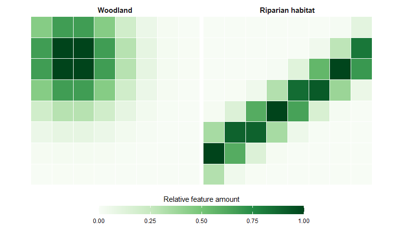
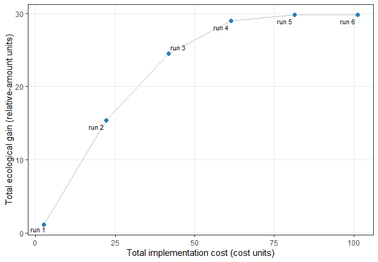
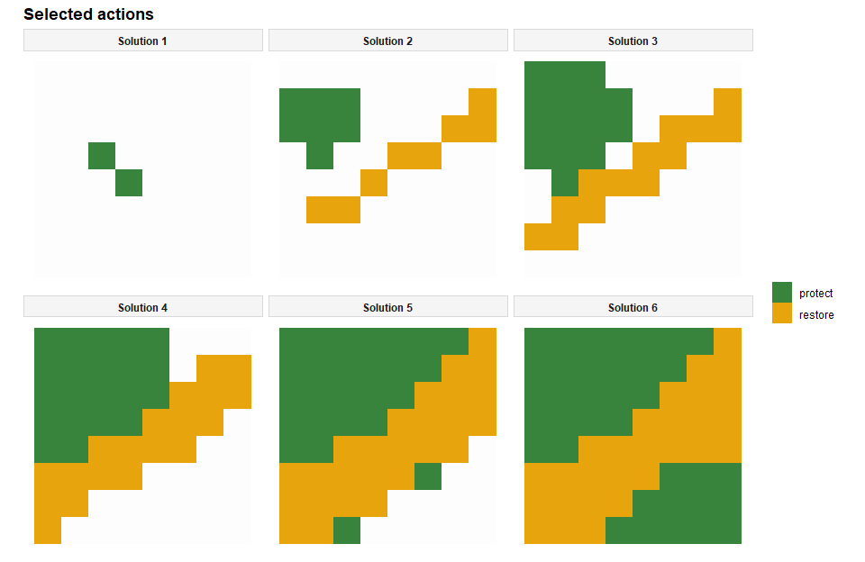

<!-- README.md is generated from README.Rmd. Please edit that file -->

# Multi-objective spatial planning in R 

<!-- badges: start -->

[](https://CRAN.R-project.org/package=multiscape)
[](https://cran.r-project.org/package=multiscape)
[](https://lifecycle.r-lib.org/articles/stages.html)
[](https://github.com/josesalgr/multiscape/actions/workflows/R-CMD-check.yaml)
[](https://app.codecov.io/gh/josesalgr/multiscape)
<!-- badges: end -->

`multiscape` is an exact optimisation framework for **multi-action,
multi-objective spatial planning in R**. It is designed for problems in
which decisions involve allocating alternative management actions across
planning units while balancing multiple competing objectives. Building
on the transition from place-based prioritisation towards spatially
explicit action planning ([Tallis et al.,
2021](https://doi.org/10.1111/nyas.14651); [Salgado-Rojas et al.,
2023](https://doi.org/10.1111/2041-210X.14220)), `multiscape` represents
explicitly **what can be done, where it can be done, and what
consequences those actions are expected to produce**.

Users define feasible management actions, their costs, and their
expected effects on ecological or socioeconomic features relative to a
reference scenario. These action-based decisions are represented as
mixed-integer linear programming (MILP) models together with targets,
budgets, spatial requirements, locked decisions, and other constraints.
Multiple objectives, including cost, benefit, profit, and fragmentation,
can be registered independently and explored using weighted-sum,
epsilon-constraint, and AUGMECON methods. This formulation also provides
a basis for multiple-use spatial planning, where alternative actions and
uses may need to be evaluated against competing ecological, economic,
and social objectives ([Neubert et al.,
2025](https://doi.org/10.1016/j.tree.2025.09.007)).

Each retained solution preserves the correspondence between its
objective values and its spatial allocation of actions. Alternative
plans can therefore be examined in **objective space** (`frontier_*()`),
**decision space** (`selection_*()`), and jointly through
**objective–decision linkage** (`linkage_*()`), allowing users to relate
changes in performance directly to changes in the actions implemented
across space.

## Installation

Install the stable version from [Comprehensive R Archive Network
(CRAN)](https://cran.r-project.org/):

``` r
install.packages("multiscape")
```

Or install the lastest development version from
[GitHub](https://github.com/josesalgr/multiscape):

``` r
if (!requireNamespace("remotes", quietly = TRUE)) {
  install.packages("remotes")
}
remotes::install_github("josesalgr/multiscape")
```

## Getting started

### The planning problem

The following example represents a stylised **multi-objective multi-use
spatial planning problem**. The landscape is divided into 64 planning
units and contains two ecological features: woodland and riparian
habitat. Each planning unit can remain unmanaged or be assigned to one
of two mutually exclusive management actions: **protection** or
**restoration**.

For every planning unit $i$ and action $a$, the model defines a binary
decision variable $x_{ia}$. The variable equals 1 when action $a$ is
assigned to planning unit $i$, and 0 otherwise. Because the actions are
mutually exclusive, at most one action can be selected in each planning
unit. A planning unit may also remain without intervention.

The analysis asks:

> How does the spatial allocation of protection and restoration change
> as progressively larger implementation budgets become available, and
> how much additional ecological benefit can be obtained?

For each planning unit, `amount` is a synthetic **relative feature
amount**. Baseline values range from 0 to 1: a value of 0 represents no
local amount of the feature, whereas 1 is the largest baseline amount
represented in the simulated landscape. Intermediate values are
continuous relative amounts, not probabilities of occurrence or binary
presence–absence observations. Woodland forms a north-western hotspot,
whereas riparian habitat follows a diagonal corridor.

The 0–1 scale applies to the baseline values only. Because these are
relative indices rather than probabilities or proportions,
action-induced final amounts may exceed 1. For example, doubling a
baseline amount of 0.6 produces a final relative amount of 1.2.

All inputs are included with `multiscape`:

``` r
# load packages
library(multiscape)
library(dplyr)

# Load a complete simulated planning problem.
example_data <- load_sim_multiaction()
```

The object contains the following linked tables:

- `planning_units`: planning-unit identifiers, geometries, and baseline
  costs;
- `features`: identifiers and names of the ecological features;
- `dist_features`: baseline feature amounts by planning unit;
- `actions`: the available management actions;
- `action_costs`: the cost of each feasible planning-unit–action
  combination;
- `effects`: the expected effect of each action on each feature; and
- `effect_assumptions`: the coefficients used to generate the simulated
  effects.

The simulated baseline feature amounts are shown below.



### Stage 1: Create the base problem

[`create_problem()`](https://josesalgr.github.io/multiscape/reference/create_problem.html)
establishes the spatial domain and the ecological features being
planned. Here, `planning_units` contains the 64 geometries, `features`
defines the feature catalogue, and `dist_features` links every planning
unit to its woodland and riparian amounts. The planning-unit `cost`
column is retained in the problem, although the objective used below
includes only action-specific implementation costs.

``` r
# Initialise the problem using planning-unit geometries and baseline feature
# amounts.
problem <- create_problem(
  pu = example_data$planning_units,
  features = example_data$features,
  dist_features = example_data$dist_features,
  cost = "cost"
)
```

### Stage 2: Define actions and their effects

[`add_actions()`](https://josesalgr.github.io/multiscape/reference/add_actions.html)
registers protection and restoration as alternative management uses,
associates each action with its local implementation cost, and defines
the feasible planning-unit–action combinations. Both actions are
available throughout this landscape. The model permits at most one
selected action per planning unit, while leaving a unit unmanaged
remains feasible.

Effects describe changes relative to the reference scenario in
`dist_features`.
[`add_effects()`](https://josesalgr.github.io/multiscape/reference/add_effects.html)
accepts exactly one of three columns:

- `effect`: signed absolute change;
- `outcome`: expected amount under the action;
- `relative_change`: proportional change (`0.25` means +25%).

With a reference amount of 100, `effect = 30`, `outcome = 130`, and
`relative_change = 0.30` all describe the same result. A positive effect
means an increase; whether that is desirable depends on the feature and
objective. The reference may represent current conditions, a future
without intervention, or existing management. Outcomes and references
must share units and horizon.

This example supplies relative changes by action and feature. The
package expands them over feasible planning units. A reference of 0.6
and `relative_change = 1` produce an effect of 0.6 and an outcome of
1.2. Legacy `effect_type`, `multiplier`, and `delta` inputs remain
supported with a lifecycle deprecation warning.

``` r
# Inspect the assumptions used to generate their
# ecological effects, and the first planning-unit--action--feature records.
example_data$effect_assumptions
#>    action feature relative_change
#> 1 protect       1            1.00
#> 2 protect       2            0.30
#> 3 restore       1            0.25
#> 4 restore       2            1.30

problem <- problem |>
  add_actions(
    actions = example_data$actions,
    cost = example_data$action_costs
  ) |>
  add_effects(
    effects = example_data$effect_assumptions
  )
```

### Repeated calls and alternative configurations

Actions, effects, profit, solver settings, an MO method, and an
unaliased single objective can each be defined **once per problem**. A
second call raises an error, even with identical inputs. This also
applies to solver and effects wrappers. Put all solver settings and the
complete effects table in their first calls. Defaults do not count as an
explicit configuration.

Distinct action sets, objective aliases, spatial relation names, and
constraint definitions accumulate. Duplicate definitions raise an error.
Absolute and relative targets share the same feature/action-scope
identity. Locks accumulate compatible states; identical repeats are
allowed and contradictions are rejected.

To compare configurations, keep a common problem before the setting to
vary:

``` r
cbc_problem <- problem |> set_solver_cbc(gap_limit = 0, time_limit = 60)
gurobi_problem <- problem |> set_solver_gurobi(gap_limit = 0, time_limit = 60)
```

Both alternatives have their own solver configuration. Apply the same
pattern when comparing effect scenarios, MO methods, or run designs. See
the [repeated-call
contract](https://josesalgr.github.io/multiscape/articles/Repeated_calls.html)
for identities, accumulation rules, and migration examples.

### Optional: register action sets

[`add_action_sets()`](https://josesalgr.github.io/multiscape/reference/add_action_sets.html)
records named combinations of existing actions. It accepts a named list
or a long table with columns `set` and `action`. One action may belong
to several sets. The following independent example defines restoration
with threat control and restoration with fencing:

``` r
actions_problem <- create_problem(
  pu = data.frame(id = 1:2, cost = 1),
  features = data.frame(id = 1L, name = "woodland"),
  dist_features = data.frame(pu = 1:2, feature = 1L, amount = 10)
) |>
  add_actions(
    actions = data.frame(id = c("restore", "control", "fence")),
    cost = 1
  )

memberships <- data.frame(
  set = c("restore_control", "restore_control", "restore_fence", "restore_fence"),
  action = c("restore", "control", "restore", "fence")
)
sets_problem <- add_action_sets(actions_problem, memberships)
get_action_sets(sets_problem)
#>               set  action
#> 1 restore_control control
#> 2 restore_control restore
#> 3   restore_fence   fence
#> 4   restore_fence restore

# The named-list input produces the same definitions.
list_problem <- add_action_sets(actions_problem, list(
  restore_control = c("restore", "control"),
  restore_fence = c("restore", "fence")
))
identical(get_action_sets(sets_problem), get_action_sets(list_problem))
#> [1] TRUE
```

Registering sets leaves the individual actions and their feasible pairs
intact. It does not require joint selection, introduce interactions, or
enable multiple selected actions per unit. In this release, set
identifiers are definitions only; effects, objectives, and constraints
still receive individual action ids. The [action-set
vignette](https://josesalgr.github.io/multiscape/articles/Action_sets.html)
explains validation and adding new sets across calls.

### Optional: configure action counts per unit

[`add_constraint_action_cardinality()`](https://josesalgr.github.io/multiscape/reference/add_constraint_action_cardinality.html)
sets a minimum, maximum, or exact number of individual actions in each
specified planning unit. Multiple calls can define different capacities
or constrain particular action subsets. This independent example allows
up to four actions in unit 10 and two in unit 20; unit 30 keeps the
default maximum of one:

``` r
count_problem <- create_problem(
  pu = data.frame(id = c(10L, 20L, 30L), cost = 1),
  features = data.frame(id = 1L, name = "woodland"),
  dist_features = data.frame(pu = c(10L, 20L, 30L), feature = 1L, amount = 10)
) |>
  add_actions(
    data.frame(id = c("restore", "control", "fence", "monitor")), cost = 1
  ) |>
  add_constraint_action_cardinality(4, "max", pu = 10L) |>
  add_constraint_action_cardinality(2, "max", pu = 20L) |>
  add_constraint_action_cardinality(
    1, "min", actions = c("restore", "control"), pu = c(10L, 20L)
  )
count_problem$data$constraints$action_cardinality
#>                 type count sense                 name          actions     pu
#> 1 action_cardinality     4   max action_cardinality_1             NULL     10
#> 2 action_cardinality     2   max action_cardinality_2             NULL     20
#> 3 action_cardinality     1   min action_cardinality_3 control, restore 10, 20
```

An explicit total maximum or equality (`actions = NULL`) replaces the
implicit one-action maximum only in the units it covers. Subset rules
and minima alone retain that default. Overlapping explicit rules must
all be satisfied; later calls do not overwrite earlier ones. Registering
a set adds no counted decision. The optional `name` labels a constraint
independently of objective aliases.

Concurrent actions currently support cost/profit workflows. Compilation
rejects concurrent ecological effects until joint-effect and feature
aggregation are implemented, to avoid counting reference amounts
repeatedly. The main ecological example below retains its one-action
maximum. See the [action-cardinality
vignette](https://josesalgr.github.io/multiscape/articles/Action_cardinality.html)
for exact counts, subset rules, and a solved economic example.

### Optional: define logical relations between actions

Logical relations constrain **which actions can be selected together in
each unit**. They complement cardinality, which controls how many
actions can be selected. Distinct calls accumulate; duplicate
definitions or names are errors.

``` r
relations_problem <- actions_problem |>
  add_constraint_action_cardinality(3, "max") |>
  # Restoration needs threat control in unit 1.
  add_constraint_action_requires("restore", "control", pu = 1L) |>
  # In unit 2, either control or fencing is sufficient.
  add_constraint_action_requires(
    "restore", c("control", "fence"), sense = "any", pu = 2L
  ) |>
  # Control and fencing are alternative interventions in both units.
  add_constraint_action_excludes(c("control", "fence"))

# A separate alternative implements restoration and control together or neither.
together_problem <- actions_problem |>
  add_constraint_action_cardinality(2, "max") |>
  add_constraint_action_together(c("restore", "control"))
relations_problem$data$constraints$action_relations
#>       type sense              name        actions       requires   pu
#> 1 requires   all action_requires_1        restore        control    1
#> 2 requires   any action_requires_2        restore control, fence    2
#> 3 excludes  <NA> action_excludes_3 control, fence           NULL 1, 2
```

`requires` is directional: selecting control does not force restoration.
`together` requires all group members or none; `excludes` permits at
most one member, including zero. An unavailable companion prevents an
all dependency; an any dependency can use the remaining companions. An
unavailable together member prevents the whole group. These rules apply
to the feasible set shared by all optimization methods. They introduce
no ecological interaction coefficients. See the [action-relations
vignette](https://josesalgr.github.io/multiscape/articles/Action_relations.html)
for solved examples, set members, scope, and compatibility with
cardinality.

### Stage 3: Define the constraints

[`add_constraint_targets_relative()`](https://josesalgr.github.io/multiscape/reference/add_constraint_targets_relative.html)
requires the selected actions to generate gains equivalent to at least
10% of the total baseline amount of **each feature separately**. Targets
restrict the feasible set; they are not additional objectives. Other
applications could introduce budgets, area requirements, locked
decisions, or spatial constraints at this stage.

``` r
# Require action-induced gains of at least 10% of the total baseline amount of
# woodland and at least 10% of the total baseline amount of riparian habitat.
problem <- problem |>
  add_constraint_targets_relative(0.10)
```

### Stage 4: Define the objectives

Objectives are registered independently so they can later be combined
using different multi-objective methods.
[`add_objective_min_cost()`](https://josesalgr.github.io/multiscape/reference/add_objective_min_cost.html)
minimises the total implementation cost of the selected actions.
Planning-unit costs are excluded because the example defines economic
expenditure through the action-specific cost table.
[`add_objective_max_benefit()`](https://josesalgr.github.io/multiscape/reference/add_objective_max_benefit.html)
maximises total ecological benefit, calculated as the sum of
action-induced gains across selected planning units and features.

Because woodland and riparian effects use the same relative scale and no
feature-specific weights are supplied, the example gives both features
equal weight in the benefit objective. See the
[`add_objective_max_benefit()`
reference](https://josesalgr.github.io/multiscape/reference/add_objective_max_benefit.html)
for the complete definition of the objective, its available arguments,
and how feature contributions are aggregated.

``` r
problem <- problem |>
  # Minimise action-specific implementation costs. Planning-unit costs are
  # excluded because expenditure is represented by the action-cost table.
  add_objective_min_cost(
    alias = "cost",
    include_pu_cost = FALSE,
    include_action_cost = TRUE
  ) |>
  # Maximise the sum of action-induced ecological gains across both features.
  add_objective_max_benefit(alias = "benefit")
```

The summary confirms that the spatial inputs, actions, effects,
constraints, and two objectives are present. It also shows that the
multi-objective method and solver have not yet been selected.

``` r
# Print the complete formulation before selecting a multi-objective method
# and optimisation solver.
problem
#> A multiscape object (<Problem>)
#> +-data
#> |+-planning units: <data.frame> (64 total)
#> |+-costs: min: 0, max: 0
#> |\-features: 2 total ("woodland", "riparian")
#> \-actions and effects
#> |+-actions: 2 total ("Protect", "Restore")
#> |+-feasible action pairs: 128 feasible rows
#> |+-action costs: min: 1.05, max: 2.3
#> |+-effect data: 256 rows
#> |+-effect input: relative change
#> |+-effect signs: 256 positive, 0 negative, 0 zero
#> |\-profit data: none
#> \-spatial
#> |+-geometry: sf (64 rows)
#> |+-coordinates: 64 rows (x: 0.5..7.5, y: 0.5..7.5)
#> |\-relations: none
#> \-targets and constraints
#> |+-targets: 2 rows
#> |+-target preview: "woodland" >= 1.409, "riparian" >= 1.345
#> |+-area constraints: none
#> |+-budget constraints: none
#> |+-planning-unit locks: none
#> |\-action locks: none
#> \-model
#> |+-status: not built yet (will build in solve())
#> |+-objectives: 2 registered (benefit, cost)
#> |+-method: not set
#> |+-solver: not set (auto)
#> |\-checks: incomplete (multiple objectives registered but no MO method
#> selected)
#> # i Use `x$data` to inspect stored tables and model snapshots.
```

### Configure the multi-objective method

The registered objectives define what the plans should achieve; the
multi-objective method determines how the trade-off between them is
explored. Here,
[`set_method_epsilon_constraint()`](https://josesalgr.github.io/multiscape/reference/set_method_epsilon_constraint.html)
treats ecological benefit as the primary objective and evaluates six
increasingly permissive limits on total cost. For each cost limit, the
model identifies the feasible plan with the greatest ecological benefit.

With `lexicographic = TRUE`, solutions tied on the primary benefit
objective are refined by minimising cost. This prevents the method from
returning an unnecessarily expensive plan when a less costly plan
attains the same benefit. The six limits are generated by
[`set_runs_grid()`](https://josesalgr.github.io/multiscape/reference/set_runs_grid.html).
The example uses Gurobi through
[`set_solver_gurobi()`](https://josesalgr.github.io/multiscape/reference/set_solver_gurobi.html),
which requires the Gurobi R package and a valid licence.

``` r
problem <- problem |>
  # Maximise benefit under six alternative limits on total cost.
  # Lexicographic refinement selects the least-cost plan among solutions tied
  # on the primary objective.
  set_method_epsilon_constraint(
    primary = "benefit",
    runs = set_runs_grid(6),
    lexicographic = TRUE
  ) |>
  set_solver_gurobi(gap_limit = 0)
```

### Solve the problem

[`solve()`](https://josesalgr.github.io/multiscape/reference/solve.html)
returns a `SolutionSet` containing the solver status, objective values,
selected action assignments, and run-level information for every
epsilon-constraint problem.
[`get_objectives()`](https://josesalgr.github.io/multiscape/reference/get_objectives.html)
extracts the resulting objective values, with one row per stored
solution and one column per objective.

``` r
solutions <- solve(problem)
get_objectives(solutions, format = "wide")
#>   solution_id   benefit   cost
#> 1           1  1.185508   2.60
#> 2           2 15.359707  22.25
#> 3           3 24.535156  41.91
#> 4           4 29.006289  61.41
#> 5           5 29.782291  81.46
#> 6           6 29.796218 101.28
```

### Link run configurations to stored solutions

A multi-objective method evaluates a sequence of optimisation
configurations.
[`get_runs()`](https://josesalgr.github.io/multiscape/reference/get_runs.html)
returns the registry of these configurations together with their solver
outcomes and, when available, the identifier of the solution they
produced.

``` r
runs <- get_runs(solutions)
runs
#>   run_id solution_id  status     runtime gap
#> 1      1           1 optimal 0.006000042   0
#> 2      2           2 optimal 0.013999939   0
#> 3      3           3 optimal 0.016999960   0
#> 4      4           4 optimal 0.003000021   0
#> 5      5           5 optimal 0.010999918   0
#> 6      6           6 optimal 0.003999949   0
```

Each row records one attempted run configuration. `run_id` identifies
the configuration, including its epsilon limit and solver outcome. A run
is not itself a solution: an infeasible configuration, a run that
terminates without a feasible solution, or a run affected by a solver
error may have no associated `solution_id`. When a run does produce a
solution that is retained in the `SolutionSet`, `solution_id` identifies
that stored solution for subsequent extraction, comparison, and mapping.
In this example, all configured runs produce stored solutions.

The treatment of infeasible runs, runs without a solution, and
unexpected errors can be controlled with
[`set_runs_control()`](https://josesalgr.github.io/multiscape/reference/set_runs_control.html).
Depending on these settings, solving can stop when a failed
configuration is encountered or retain the failed run in the run history
without an associated solution.

This distinction is important when reading the figures below. With
`label_runs = TRUE`, `plot_tradeoff()` labels points using `run_id`,
whereas functions that extract or map stored plans generally use
`solution_id`. `get_runs()` provides the link between the run
configurations and the solutions that were successfully stored.

## Interpret the solutions

### Objective space: performance and trade-offs

Each point below represents a stored spatial solution generated by one
epsilon-constraint run. The plot is produced with
[`plot_tradeoff()`](https://josesalgr.github.io/multiscape/reference/plot_tradeoff.html).
With lexicographic refinement, the returned plans are intended to lie on
the **observed efficient frontier**. This is the frontier represented by
the six runs evaluated here, not necessarily every attainable trade-off
in the complete discrete solution space.

The horizontal axis shows the cost actually incurred by each solution,
which may be lower than the upper cost limit imposed in its run. The
vertical axis shows total ecological benefit, obtained by summing the
action-induced gains across both features and all selected planning
units. Moving from left to right therefore reveals how the maximum
observed ecological benefit changes as more expensive plans become
available.

``` r
plot_tradeoff(
  solutions,
  objectives = c("cost", "benefit"),
  connect = TRUE,
  label_runs = TRUE
) +
  ggplot2::labs(
    x = "Total implementation cost (cost units)",
    y = "Total ecological gain (relative-amount units)"
  )
```



The curve rises rapidly at first and becomes flatter near its
high-benefit end. In this region, substantial increases in
implementation cost produce only small additional ecological gains. The
result illustrates declining marginal returns and helps identify where
further expenditure has comparatively little effect.

### Identify a compromise solution

A multi-objective analysis should consider both **objective space**,
which describes how well each plan performs, and **decision space**,
which describes where actions are allocated.
[`frontier_knee()`](https://josesalgr.github.io/multiscape/reference/frontier_knee.html)
identifies an empirical compromise on the observed frontier: a solution
near the point where additional ecological gains begin to require
comparatively large increases in cost.

``` r
knee <- frontier_knee(
  solutions,
  objectives = c("cost", "benefit")
)
knee |> dplyr::select(solution_id, cost, benefit, knee_score, method)
#>   solution_id  cost  benefit knee_score   method
#> 1           3 41.91 24.53516   0.295399 distance
```

The knee is a decision aid rather than a universally optimal answer. Its
location depends on the solutions included in the observed frontier, the
normalisation of the objectives, and the geometric criterion used to
calculate the knee score. It should therefore be interpreted alongside
policy preferences and the spatial characteristics of the selected plan.

[`frontier_extremes()`](https://josesalgr.github.io/multiscape/reference/frontier_extremes.html)
and
[`frontier_distances()`](https://josesalgr.github.io/multiscape/reference/frontier_distances.html)
provide complementary views of the observed objective space. They
identify the objective-wise extremes and calculate each solution’s
normalised distance from the observed ideal and nadir points.

``` r
frontier_extremes(
  solutions,
  objectives = c("cost", "benefit"),
  ties = "first"
)
#>   solution_id objective sense bound  role      value
#> 1           1      cost   min   min  best   2.600000
#> 2           6      cost   min   max worst 101.280000
#> 3           1   benefit   max   min worst   1.185508
#> 4           6   benefit   max   max  best  29.796218

frontier_distances(
  solutions,
  objectives = c("cost", "benefit")
)
#>   solution_id   cost   benefit norm_cost norm_benefit distance_to_ideal
#> 1           1   2.60  1.185508 0.0000000 1.0000000000         1.0000000
#> 2           2  22.25 15.359707 0.1991285 0.5045841386         0.5424549
#> 3           3  41.91 24.535156 0.3983583 0.1838843574         0.4387514
#> 4           4  61.41 29.006289 0.5959668 0.0276095455         0.5966060
#> 5           5  81.46 29.782291 0.7991488 0.0004867732         0.7991489
#> 6           6 101.28 29.796218 1.0000000 0.0000000000         1.0000000
#>   rank_to_ideal
#> 1             5
#> 2             2
#> 3             1
#> 4             3
#> 5             4
#> 6             5
```

### Decision space: spatial prescriptions

Plans that are close in objective space can still prescribe different
actions in different locations.
[`plot_spatial_actions()`](https://josesalgr.github.io/multiscape/reference/plot_spatial_actions.html)
complements the trade-off plot by showing how protection and restoration
are reallocated as the cost limit is relaxed. Planning units shown only
through the base layer receive no management action in the corresponding
solution. In the call below, `solutions = 1:6` selects **solution IDs**,
not run IDs; the preceding run registry provides the link between the
two identifiers.

``` r
plot_spatial_actions(
  solutions,
  solutions = 1:6,
  fill_values = c(
    protect = "#2E7D32",
    restore = "#E69F00"
  ),
  base_alpha = 0.12
)
```



The sequence of maps should be interpreted together with the baseline
feature patterns. Protection and restoration may expand into new
planning units as larger budgets become available, but actions can also
be substituted or relocated when a different spatial combination
produces greater benefit under the active cost limit.

### Compare spatial similarity

Similar objective values do not necessarily imply similar spatial
prescriptions.
[`selection_similarity()`](https://josesalgr.github.io/multiscape/reference/selection_similarity.html)
compares the sets of selected planning-unit–action pairs for every pair
of solutions. Jaccard similarity is useful here because it focuses on
jointly selected assignments and does not inflate similarity through
planning units that remain unmanaged in both plans.

A value of 1 indicates identical sets of selected assignments, whereas 0
indicates that the two solutions share no selected planning-unit–action
pair. Rows and columns correspond to solution identifiers, and the
diagonal is always 1 because every solution is identical to itself.

``` r
selection_similarity(
  solutions,
  metric = "jaccard",
  format = "matrix"
)
#>            1         2          3          4          5          6
#> 1 1.00000000 0.0000000 0.03448276 0.02439024 0.01886792 0.01538462
#> 2 0.00000000 1.0000000 0.53571429 0.37500000 0.28846154 0.23437500
#> 3 0.03448276 0.5357143 1.00000000 0.70000000 0.53846154 0.43750000
#> 4 0.02439024 0.3750000 0.70000000 1.00000000 0.76923077 0.62500000
#> 5 0.01886792 0.2884615 0.53846154 0.76923077 1.00000000 0.78461538
#> 6 0.01538462 0.2343750 0.43750000 0.62500000 0.78461538 1.00000000
#> attr(,"metric")
#> [1] "jaccard"
```

### Identify recurrent action assignments

[`selection_frequency()`](https://josesalgr.github.io/multiscape/reference/selection_frequency.html)
calculates how often each planning-unit–action pair is selected across
the solution set. In this example, frequency is the proportion of the
six solutions containing a particular assignment. High frequency
indicates recurrence across the explored trade-offs, but it should not,
on its own, be interpreted as ecological irreplaceability.

``` r
action_frequency <- selection_frequency(solutions)
head(
  action_frequency[order(-action_frequency$frequency), ],
  10
)
#>    pu  action n_selected n_solutions frequency
#> 20 18 restore          5           6 0.8333333
#> 22 19 restore          5           6 0.8333333
#> 42 28 restore          5           6 0.8333333
#> 55 34 protect          5           6 0.8333333
#> 57 35 protect          5           6 0.8333333
#> 62 37 restore          5           6 0.8333333
#> 64 38 restore          5           6 0.8333333
#> 71 41 protect          5           6 0.8333333
#> 73 42 protect          5           6 0.8333333
#> 75 43 protect          5           6 0.8333333
```

### Link objective performance to spatial change

Objective-space proximity does not necessarily imply similar spatial
prescriptions.
[`frontier_neighbors()`](https://josesalgr.github.io/multiscape/reference/frontier_neighbors.html)
identifies local neighbours along the observed objective-space
trade-off. Here, solutions are oriented towards increasing ecological
benefit, matching the progression from lower- to higher-budget plans
used above.
[`linkage_distances()`](https://josesalgr.github.io/multiscape/reference/linkage_distances.html)
then compares those same solution pairs in objective and decision space.

``` r
neighbors <- frontier_neighbors(
  solutions,
  objectives = c("benefit", "cost")
)

linkage <- linkage_distances(
  solutions,
  objectives = c("cost", "benefit"),
  pairs = neighbors,
  decision_metric = "jaccard"
)

linkage |>
  dplyr::select(
    from_solution,
    to_solution,
    objective_distance,
    decision_distance,
    changed_planning_units
  )
#>   from_solution to_solution objective_distance decision_distance
#> 1             1           2          0.5339373         1.0000000
#> 2             2           3          0.3775459         0.4642857
#> 3             3           4          0.2519343         0.3000000
#> 4             4           5          0.2049843         0.2307692
#> 5             5           6          0.2008518         0.2153846
#>   changed_planning_units
#> 1                     16
#> 2                     13
#> 3                     12
#> 4                     12
#> 5                     13
```

The two distances describe different aspects of the same comparison:
`objective_distance` measures separation in normalised objective space,
whereas `decision_distance` measures dissimilarity between spatial
action allocations. Keeping them separate makes it possible to identify
similar levels of performance that require substantially different
spatial plans.

[`linkage_transition()`](https://josesalgr.github.io/multiscape/reference/linkage_transition.html)
provides a more detailed view of a selected comparison. Here, we examine
the transition from solution 3 to solution 4.

``` r
transition <- linkage_transition(
  solutions,
  from = 3,
  to = 4,
  objectives = c("cost", "benefit")
)

transition
#> Spatial solution transition
#> From solution: 3 
#> To solution:   4 
#> 
#> Planning units changed: 12 of 64 (18.8%)
#> Activated:            12 
#> Deactivated:          0 
#> Action switches:      0 
#> Composition changes:  0 
#> 
#> Objective changes:
#> - cost: 19.5 (improvement -19.5)
#> - benefit: 4.47113 (improvement 4.47113)
#> 
#> Use `$summary`, `$objectives`, `$transitions`, `$actions`, or `$state_matrix` for details.
```

The printed summary reports objective and decision distances, the number
of planning units whose state changes, and the corresponding changes in
each objective. Detailed planning-unit, action, and state-transition
tables remain available within the returned object.

[`linkage_turnover()`](https://josesalgr.github.io/multiscape/reference/linkage_turnover.html)
extends these local comparisons by relating decision-space turnover to
the associated objective-space change. Its `reconfiguration_rate`
highlights local transitions that require comparatively large spatial
changes for a given separation in objective performance.

``` r
turnover <- linkage_turnover(
  solutions,
  objectives = c("cost", "benefit"),
  pairs = neighbors,
  decision_metric = "jaccard"
)

turnover |>
  dplyr::select(
    from_solution,
    to_solution,
    objective_distance,
    decision_distance,
    reconfiguration_rate
  )
#>   from_solution to_solution objective_distance decision_distance
#> 1             1           2          0.5339373         1.0000000
#> 2             2           3          0.3775459         0.4642857
#> 3             3           4          0.2519343         0.3000000
#> 4             4           5          0.2049843         0.2307692
#> 5             5           6          0.2008518         0.2153846
#>   reconfiguration_rate
#> 1             1.872879
#> 2             1.229747
#> 3             1.190786
#> 4             1.125790
#> 5             1.072356
```

Informative pairs can then be selected reproducibly with
[`linkage_contrasts()`](https://josesalgr.github.io/multiscape/reference/linkage_contrasts.html).
For example, the contrasts below identify the local transitions with the
largest spatial reconfiguration relative to objective-space change.

``` r
linkage_contrasts(
  turnover,
  type = "high_reconfiguration",
  n = 2
) |>
  dplyr::select(
    contrast_rank,
    contrast_type,
    from_solution,
    to_solution,
    objective_distance,
    decision_distance,
    reconfiguration_rate
  )
#>   contrast_rank        contrast_type from_solution to_solution
#> 1             1 high_reconfiguration             1           2
#> 2             2 high_reconfiguration             2           3
#>   objective_distance decision_distance reconfiguration_rate
#> 1          0.5339373         1.0000000             1.872879
#> 2          0.3775459         0.4642857             1.229747
```

`selection_consistency()` provides a complementary decision-space
summary of which planning-unit states recur or vary across the
alternatives considered.

## What can `multiscape` do?

A planning problem can combine:

- planning units and spatially distributed features;
- alternative actions and action-specific effects;
- targets, budgets, area requirements, and locked decisions;
- boundary, adjacency, distance, and other spatial relations;
- objectives for cost, benefit, loss, profit, impact, and fragmentation;
- post-optimisation analysis in objective space, decision space, and
  their objective–decision linkage; and
- commercial or open-source optimisation solvers.

Objectives are registered independently from the method used to combine
them. `multiscape` currently implements:

- **weighted sum** for preference-based combinations of objectives;
- **epsilon-constraint** for policy or performance thresholds; and
- **AUGMECON**, the augmented epsilon-constraint method, for systematic
  generation of efficient alternatives.

<figure>

<figcaption aria-hidden="true">The multiscape workflow: define the
problem, add actions and effects, specify constraints and objectives,
solve, and compare spatial plans.</figcaption>
</figure>

## Learn more

Browse the [function
reference](https://josesalgr.github.io/multiscape/reference/) or the
documentation for the main workflow functions: `create_problem()`,
`add_actions()`, `add_effects()`, `add_constraint_targets_relative()`,
the `set_method_*()` family, and `solve()`. Post-optimisation tools are
organized into the `frontier_*()`, `selection_*()`, and `linkage_*()`
families.

If you find a bug or would like to suggest an improvement, please open
an [issue](https://github.com/josesalgr/multiscape/issues).

## References

Tallis, H., Fargione, J., Game, E., et al. (2021). Prioritizing actions:
spatial action maps for conservation. *Annals of the New York Academy of
Sciences*, **1505**(1), 118–141.
[doi:10.1111/nyas.14651](https://doi.org/10.1111/nyas.14651).

Salgado-Rojas, J., Hermoso, V., & Álvarez-Miranda, E. (2023).
prioriactions: Multi-action management planning in R. *Methods in
Ecology and Evolution*.
[doi:10.1111/2041-210X.14220](https://doi.org/10.1111/2041-210X.14220).

Neubert, S., McGowan, J., Metcalfe, K., et al. (2025). Multiple-use
spatial planning for sustainable development and conservation. *Trends
in Ecology & Evolution*, **40**(11), 1126–1142.
[doi:10.1016/j.tree.2025.09.007](https://doi.org/10.1016/j.tree.2025.09.007).
