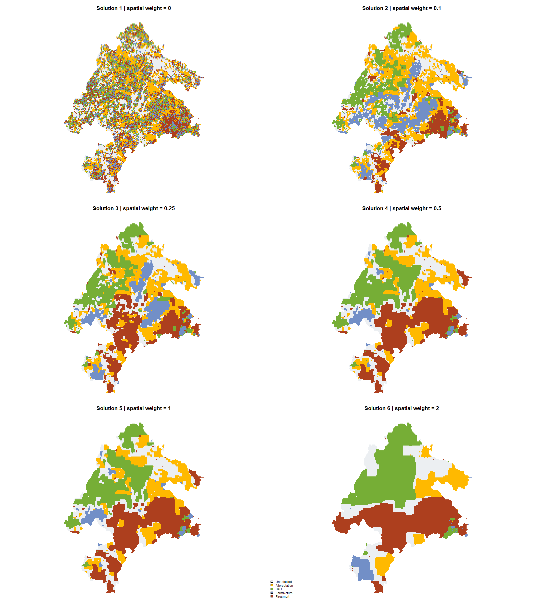
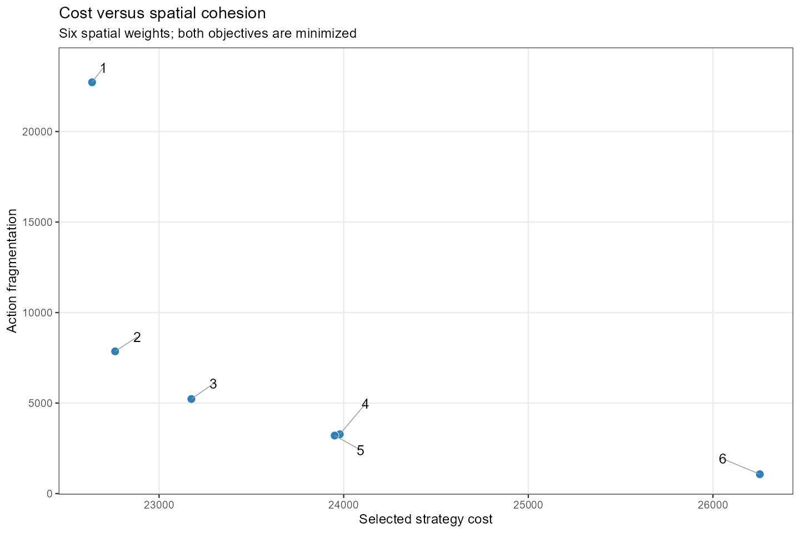

<!-- README.md is generated from README.Rmd. Please edit that file -->


# Multi-objective spatial planning in R 

<!-- badges: start -->
[](https://CRAN.R-project.org/package=multiscape)
[](https://cran.r-project.org/package=multiscape)
[](https://lifecycle.r-lib.org/articles/stages.html)
[](https://github.com/josesalgr/multiscape/actions/workflows/R-CMD-check.yaml)
[](https://app.codecov.io/gh/josesalgr/multiscape)
<!-- badges: end -->


`multiscape` is an exact optimisation framework for **multi-action,
multi-objective spatial planning in R**. It is designed for problems in which
decisions involve allocating alternative management actions across planning
units while balancing multiple competing objectives. Building on the transition
from place-based prioritisation towards spatially explicit action planning
([Tallis et al., 2021](https://doi.org/10.1111/nyas.14651);
[Salgado-Rojas et al., 2023](https://doi.org/10.1111/2041-210X.14220)),
`multiscape` represents explicitly **what can be done, where it can be done,
and what consequences those actions are expected to produce**.

Users define feasible management actions, their costs, and their expected
effects on ecological or socioeconomic features relative to a reference
scenario. These action-based decisions are represented as mixed-integer linear
programming (MILP) models together with targets, budgets, spatial requirements,
locked decisions, and other constraints. Multiple objectives, including cost,
signed effects, profit, and fragmentation, can be registered independently and explored
using weighted-sum, epsilon-constraint, and AUGMECON methods. This formulation
also provides a basis for multiple-use spatial planning, where alternative
actions and uses may need to be evaluated against competing ecological,
economic, and social objectives
([Neubert et al., 2025](https://doi.org/10.1016/j.tree.2025.09.007)).

Each retained solution preserves the correspondence between its objective
values and its spatial allocation of actions. Alternative plans can therefore
be examined in **objective space** (`frontier_*()`), **decision space**
(`selection_*()`), and jointly through **objective–decision linkage**
(`linkage_*()`), allowing users to relate changes in performance directly to
changes in the actions implemented across space.

## Installation

Install the stable version from [Comprehensive R Archive Network (CRAN)](https://cran.r-project.org/):


``` r
install.packages("multiscape")
```

Or install the lastest development version from [GitHub](https://github.com/josesalgr/multiscape):


``` r
if (!requireNamespace("remotes", quietly = TRUE)) {
  install.packages("remotes")
}
remotes::install_github("josesalgr/multiscape")
```

## Getting started

### Start with a reference, then describe what actions change

A planning unit is one cell or polygon in the landscape. A feature is something
we want to represent, such as a species or an ecosystem service. For each
unit and feature, we first supply a **reference amount**: the value against
which the consequences of an action will be measured.

The reference is the **scenario you want to compare an action against**.
It can describe current conditions, a future without the proposed action,
continuation of existing management, or another explicitly chosen alternative.
It does not have to describe the landscape just before management begins.
Use reference and action amounts for the same feature, location, time horizon
and units, so their difference answers the intended comparison.

For example, suppose habitat amount is 100 today. At the planning horizon it
is expected to be 70 under business as usual (BAU), and 90 with restoration.
Relative to future BAU, the action's effect is $90-70=20$; relative to today,
the difference is $90-100=-10$. These answer different questions. A future BAU
reference captures the improvement over the expected alternative, including
avoided losses, even when the action does not restore today's amount.

[Tallis et al. (2021)](https://doi.org/10.1111/nyas.14651) describe spatial action
mapping through impacts assessed against BAU conditions: the expected world
without the action being evaluated. This illustrates why the reference should
be chosen for the comparison, rather than automatically equated with the
current state. In multiscape, supplying a reference does not itself decide
whether you optimize gains, final representation, or another criterion;
that choice is made through the constraints and objectives.

The workflow is: **supply the reference → describe actions and their outcomes
→ set requirements → find a plan → inspect the results**.
In the code below, `problem` is simply the name of the R object we build.
The function that creates it in this branch is `create_problem()`.

### The planning problem

The Meseta Ibérica offers a concrete question for spatial action planning:

> Where should alternative landscape strategies be selected
> to meet species and ecosystem-service targets at low cost, while keeping
> the resulting action maps spatially cohesive?

This example uses an earlier Prioriactions dataset associated with
[Cánibe Iglesias et al. (2025)](https://doi.org/10.1016/j.ecoser.2025.101742).
It contains 11,109 planning units, 151 species and four ecosystem services,
with four strategies: **Afforestation**, **BAU**, **FarmReturn** and **Firesmart**.
We retain the archive's original names and absolute targets.
The author-provided `Miguel_Galicia.zip` is an earlier dataset; the article's
final inputs contain 207 species. The tutorial therefore illustrates the
planning formulation on available data rather than reproducing the publication.

Here we formulate a straightforward multiscape problem: select at most one
management strategy in each cell. Each cell-strategy combination has a cost
and an expected outcome. The example teaches this formulation using available
Meseta data; the separate technical reproduction of Prioriactions is not part
of this introductory workflow.


``` r
library(multiscape)
meseta <- readRDS(system.file(
  "extdata", "meseta_iberica_inputs.rds", package = "multiscape"
))
meseta$actions
#>   id          name
#> 1  1 Afforestation
#> 2  2           BAU
#> 3  3    FarmReturn
#> 4  4     Firesmart
```

The prepared object contains the tables used throughout the tutorial:

| Input | What it describes |
| --- | --- |
| `planning_units` | Unit identifiers and their geometries |
| `features` | Species and ecosystem-service identifiers |
| `dist_features` | Reference representation credited to each unit and feature |
| `actions` | The four original strategy identifiers and names |
| `action_costs` | Implementation cost for each unit and strategy |
| `outcomes` | Representation under each selected strategy |
| `targets` | Required absolute representation of each feature |
| `boundary` | Weighted edges connecting neighbouring units |


``` r
head(meseta$action_costs)
head(meseta$outcomes)
head(meseta$targets)
```

Here, outcomes are binary and missing occurrence rows mean zero. The reference
is also zero: it records the representation credited outside selected
strategies, not a prediction that an unmanaged landscape has no biodiversity.
The service variables retain the archive's binary coding. Costs are selection
penalties in the supplied units, rather than established monetary amounts.

### Stage 1: Create the base problem

`create_problem()` receives the **reference scenario**, before any action
outcomes are added. In particular, `dist_features` contains rows with `pu`,
`feature` and `amount`: `amount` is the reference value of that feature in
that planning unit. The geometries come from `pu`, and `features` lists what
is being planned. A target is added later; it does not belong in the reference. We use zero planning-unit costs because the next stage will
attach the supplied strategy costs to actions.


``` r
pu <- meseta$planning_units
pu$cost <- 0

problem <- create_problem(
  pu = pu,
  features = meseta$features,
  dist_features = meseta$dist_features,
  cost = "cost"
)
```

With the deliberately zero reference, the constructor may warn that features
are not represented yet. Their credited representation is supplied by the
action outcomes in the next stage.

Creating the base problem does not yet specify which strategies to choose.
Actions describe the available decisions; effects describe what those decisions
produce; constraints state what a feasible plan must achieve.

### Stage 2: Define actions and their effects

Each action is one of the four management strategies: Afforestation, BAU,
FarmReturn or Firesmart. Selecting an action means choosing that strategy in
a cell. We use these names directly as action identifiers.

The input archive uses numerical strategy identifiers. The following mapping
replaces them with their names in the cost and outcome tables, so the solver
and the maps refer to the same readable actions.


``` r
strategy_names <- setNames(meseta$actions$name, meseta$actions$id)
actions <- data.frame(id = meseta$actions$name)

costs <- meseta$action_costs
costs$action <- unname(strategy_names[as.character(costs$action)])

problem <- add_actions(problem, actions = actions, cost = costs)
```

#### How does an action change the reference?

`add_effects()` describes the feature amount under the action scenario
in a cell. Let $r$ be its amount under the reference scenario, $y$ its amount
under the action scenario,
and $\Delta = y-r$ its absolute change. Supply **one** of these three columns:

| Column | What you supply | Amount after the action | Absolute change |
| --- | --- | --- | --- |
| `outcome` | The final amount $y$ | $y = \text{outcome}$ | $\Delta = \text{outcome} - r$ |
| `effect` | The absolute change $\Delta$ | $y = r + \text{effect}$ | $\Delta = \text{effect}$ |
| `relative_change` | The proportional change $q$ | $y = r(1+q)$ | $\Delta = rq$ |

For a reference of **100**, these three separate inputs all produce **130**:


``` r
# Three alternative ways to describe the SAME result; use one of them.
data.frame(pu = 1, action = "restore", feature = "habitat", outcome = 130)
data.frame(pu = 1, action = "restore", feature = "habitat", effect = 30)
data.frame(pu = 1, action = "restore", feature = "habitat", relative_change = 0.30)
```

`relative_change = 0.30` means an increase of 30%, not an increase of 30 units.
A decrease from 100 to 80 could instead be written as `outcome = 80`,
`effect = -20`, or `relative_change = -0.20`. Reference and final amounts
share units; a proportional change is dimensionless. Use exactly one of the
three columns in the effects table, rather than mixing them.

If the reference is **zero**, a proportional change still gives zero:
$0(1+q)=0$. Use an absolute outcome or effect to describe a positive amount
from a zero reference. That is why this case uses `outcome`: an outcome of
1 means one unit of credited representation under the selected strategy.
The zero reference used here is an accounting convention for this representation
example, not a BAU forecast. The strategy named BAU remains one of the four
available alternatives; its name does not automatically make it the reference.


``` r
outcomes <- meseta$outcomes
outcomes$action <- unname(strategy_names[as.character(outcomes$action)])

problem <- add_effects(problem, effects = outcomes)
```

### Stage 3: Define the constraints

Choose at most one strategy in each cell. A cell can also remain unselected.
Each feature must reach its supplied absolute representation target, counting
the outcomes of the chosen strategies. With this zero reference, the targets
are representation requirements, not gains relative to an estimated BAU future.
Fractional thresholds are retained: a binary total must reach or exceed them.


``` r
problem <- problem |>
  add_constraint_action_cardinality(
    count = 1, sense = "max", name = "one_strategy_per_cell"
  ) |>
  add_constraint_targets_absolute(meseta$targets)
```

### Stage 4: Define the objectives

We use a scalar criterion with two components:

- **Cost:** the supplied costs of the selected strategies.
- **Spatial fragmentation:** weighted edges across which selection of a
  given strategy changes between selected and unselected.

We register these components independently so their values remain available
for interpretation, then combine them into one scalar objective.
Both components refer to the same selected management actions.


``` r
problem <- problem |>
  add_spatial_relations(meseta$boundary, name = "boundary") |>
  add_objective_min_cost(include_pu_cost = FALSE, alias = "cost") |>
  add_objective_min_fragmentation_action(
    relation_name = "boundary", alias = "spatial"
  )
```

An edge contributes when neighbouring cells differ in selection of a strategy.
Minimizing this sum encourages cohesive action maps, while cost discourages
unnecessary selections. The prepared boundary table contains neighbour edges
with their original weights and excludes diagonal records.

### Configure the optimisation method

A single manual weighted run minimizes **cost + 0.5 × spatial fragmentation**.
The cost coefficient is one and the spatial coefficient is 0.5. Neither
normalization nor objective scaling is applied, so the coefficient
has a direct meaning in the supplied cost and boundary units.


``` r
# Keep the formulation before choosing an optimisation method.
action_problem <- problem
problem <- set_method_weighted_sum(
  problem,
  aliases = c("cost", "spatial"),
  runs = set_runs_manual(data.frame(weight_cost = 1, weight_spatial = 0.5)),
  normalize_weights = FALSE,
  objective_scaling = FALSE
)
```

We use 0.5 as an illustrative spatial coefficient, following the source
workflow. Registering two aliases here does not introduce a new biodiversity
objective or generate a Pareto frontier. Species and services enter through
the target constraints.

### Solve the problem

This configuration uses Gurobi, two threads, a five-minute solver time limit
and a 2% relative gap limit. Gurobi requires an installation and valid licence.
Model preparation takes additional time before the solver starts.


``` r
problem <- set_solver_gurobi(
  problem,
  gap_limit = 0.02, time_limit = 300, cores = 2,
  solver_params = list(Method = 2, NodefileStart = 0.5),
  verbose = TRUE
)
solutions <- solve(problem)
```

The gap measures the remaining difference between the best feasible objective
and the solver's bound. A 2% stopping tolerance does not prove the exact optimum
or a unique spatial plan. Check the returned status and gap before interpreting
the solution.

## Interpret the solutions

### Link the run to its stored solution

`get_runs()` connects the requested run to the retained solution, and reports
solver status, runtime and gap. `get_objectives()` returns the two components
in their original units. The weighted scalar value can be reconstructed from
these columns.


``` r
get_runs(solutions)
performance <- get_objectives(solutions, format = "wide")
performance$scalar_objective <- performance$cost + 0.5 * performance$spatial
performance
```

Read these values from your own run: solver version and stopping tolerance
can lead to different feasible plans. This simplified action formulation has
its own results; the separate Prioriactions reproduction is not its benchmark.

### Check target achievement

Objectives answer how costly or fragmented the plan is. Targets answer whether
it meets the ecological requirements. Inspect their achieved amounts separately.


``` r
head(get_targets(solutions))
```

Check all supplied targets, not just the first rows. A low cost
alone does not demonstrate target achievement; feasibility depends on the target constraints
and the selected actions that contribute representation.

### Decision space: where are the strategies selected?

Map the selected strategies to see what the plan prescribes in each cell.
Each strategy has its own map; a blank cell means that strategy was not selected
there. Because at most one strategy is allowed per cell, these maps describe
alternative spatial assignments rather than overlapping action bundles.


``` r
plot_spatial_actions(
  solutions, solutions = 1, actions = actions$id, layout = "facet", ncol = 2
)
```

The maps and objective values answer complementary questions: where to act,
and how costly or fragmented the resulting plan is. The article's maps summarize
ten replicates with different final inputs and scenarios; the tutorial first inspects
one plan and then explores alternatives from the available earlier dataset.

### An executed example

The following maps show six solved plans for the bundled inputs, using spatial
weights 0, 0.1, 0.25, 0.5, 1 and 2. Each plan meets all 155 targets. The colours
identify Afforestation (yellow), BAU (green), FarmReturn (blue), and Firesmart
(brown); grey cells have no selected action.



These are representative solved plans, not the article's ten-replicate selection
frequencies. Solver stopping gaps allow alternative assignments in later runs.
The next section explains how to generate and compare a set of plans.

### Objective space: explore the spatial-cost trade-off

Once the original single run is understood, a separate planning question is
how much extra cost greater cohesion requires. Keep the data and targets fixed
and vary the spatial coefficient. Start from `action_problem`, saved before the method was configured.
This branch accepts one method definition per problem, so create each method
configuration from that shared formulation.


``` r
spatial_exploration <- set_method_weighted_sum(
  action_problem,
  aliases = c("cost", "spatial"),
  runs = set_runs_manual(data.frame(
    weight_cost = rep(1, 6),
    weight_spatial = c(0, 0.1, 0.25, 0.5, 1, 2)
  )),
  normalize_weights = FALSE,
  objective_scaling = FALSE
)
spatial_exploration <- set_solver_gurobi(
  spatial_exploration, gap_limit = 0.02, time_limit = 300, cores = 2,
  solver_params = list(Method = 2, NodefileStart = 0.5), verbose = TRUE
)
alternatives <- solve(spatial_exploration)
get_runs(alternatives)
plot_tradeoff(
  alternatives, objectives = c("cost", "spatial"),
  connect = FALSE, label_runs = TRUE
)
```

Both components are minimized, so lower values on either axis are preferable.
Increasing the spatial coefficient prioritizes cohesion relative to cost.
Six weighted runs sample this trade-off; they do not establish the complete
frontier. This extension is a sensitivity analysis, not a replication of the
article's climate scenarios or its ten stochastic replicates.

### An observed trade-off



Both objectives are minimized. In the six audited plans above, moving from
weight 0 to weight 2 increases cost by approximately 16% and reduces action
fragmentation by approximately 95%. These runs sample the trade-off rather
than proving its complete Pareto frontier. Solution 5 improves both objective
values of solution 4, which remains in the sample because of finite stopping
gaps; frontier diagnostics use the observed non-dominated set.

### Compare spatial similarity and recurrent assignments

For a set of alternatives, objective values show performance, while decision
analysis shows whether that performance requires different actions in space.
Jaccard similarity measures overlap in selected unit-action pairs; a value of one indicates identical selected assignments.


``` r
selection_similarity(alternatives, metric = "jaccard", format = "matrix")
action_frequency <- selection_frequency(alternatives)
head(action_frequency[order(-action_frequency$frequency), ], 10)
```

Frequency measures recurrence of the four management actions across the explored
weights, not ecological irreplaceability or selection probability across the
paper's replicates. The objective, decision and linkage tools illustrated in
the [simulated workflow](examples/simulated_workflow.Rmd) provide a fuller
introduction to analysing many alternatives.

### Identify an empirical compromise

`frontier_knee()` suggests a compromise among the observed non-dominated
solutions. Its recommendation depends on the sampled weights and normalized
objective geometry; it is a decision aid, not a uniquely best plan.
`frontier_extremes()` and `frontier_distances()` describe the observed extremes
and each plan's position relative to the observed ideal and nadir.


``` r
knee <- frontier_knee(alternatives, objectives = c("cost", "spatial"))
knee
frontier_extremes(alternatives, objectives = c("cost", "spatial"))
frontier_distances(alternatives, objectives = c("cost", "spatial"))
```

### Link performance to spatial changes

Compare neighbours in objective space and ask whether moving between those
plans changes many management prescriptions. Objective distance uses normalized
performance; decision distance uses the selected unit-action pairs. Neither
measure alone describes both kinds of change.


``` r
neighbors <- frontier_neighbors(alternatives, objectives = c("cost", "spatial"))
linkage <- linkage_distances(
  alternatives, objectives = c("cost", "spatial"),
  pairs = neighbors, decision_metric = "jaccard"
)
linkage
turnover <- linkage_turnover(
  alternatives, objectives = c("cost", "spatial"),
  pairs = neighbors, decision_metric = "jaccard"
)
turnover
```

To inspect a particular transition, use its solution identifiers. The
returned object includes a summary, individual cell transitions, action changes
and a state-transition matrix. Recurrence and consistency describe this sampled
set of plans; they do not establish ecological irreplaceability.


``` r
linkage_contrasts(turnover, type = "high_reconfiguration", n = 2)
linkage_transition(
  alternatives, from = 1, to = 2, objectives = c("cost", "spatial")
)
head(selection_consistency(alternatives))
```

The executable tutorial is [examples/meseta_iberica.R](examples/meseta_iberica.R).
It includes the single-run formulation, the six-weight exploration and the
objective, decision and linkage analyses above. The
[simulated workflow](examples/simulated_workflow.Rmd) illustrates additional
methods and diagnostics on a smaller dataset.

## What can `multiscape` do?

A planning problem can combine:

- planning units and spatially distributed features;
- alternative actions and action-specific effects;
- targets, budgets, area requirements, and locked decisions;
- boundary, adjacency, distance, and other spatial relations;
- objectives for cost, signed effects, profit, and fragmentation;
- post-optimisation analysis in objective space, decision space, and their
  objective--decision linkage; and
- commercial or open-source optimisation solvers.

Objectives are registered independently from the method used to combine them.
`multiscape` currently implements:

- **weighted sum** for preference-based combinations of objectives;
- **epsilon-constraint** for policy or performance thresholds; and
- **AUGMECON**, the augmented epsilon-constraint method, for systematic
  generation of efficient alternatives.


## Learn more

Browse the [function reference](https://josesalgr.github.io/multiscape/reference/)
or the documentation for the main workflow functions:
`create_problem()`, `add_actions()`, `add_effects()`,
`add_constraint_targets_relative()`, the `set_method_*()` family, and
`solve()`. Post-optimisation tools are organized into the `frontier_*()`,
`selection_*()`, and `linkage_*()` families.

If you find a bug or would like to suggest an improvement, please open an
[issue](https://github.com/josesalgr/multiscape/issues).

## References

Cánibe Iglesias, M., Hermoso, V., Azevedo, J. C., Campos, J. C.,
Salgado-Rojas, J., Sil, Â., & Regos, A. (2025). Integrating multiple landscape
management strategies to optimise conservation under climate and planning
scenarios: a case study in the Iberian Peninsula. *Ecosystem Services*, **74**, 101742.
[doi:10.1016/j.ecoser.2025.101742](https://doi.org/10.1016/j.ecoser.2025.101742).

Tallis, H., Fargione, J., Game, E., et al. (2021). Prioritizing actions:
spatial action maps for conservation. *Annals of the New York Academy of
Sciences*, **1505**(1), 118--141.
[doi:10.1111/nyas.14651](https://doi.org/10.1111/nyas.14651).

Salgado-Rojas, J., Hermoso, V., & Álvarez-Miranda, E. (2023). prioriactions:
Multi-action management planning in R. *Methods in Ecology and Evolution*.
[doi:10.1111/2041-210X.14220](https://doi.org/10.1111/2041-210X.14220).

Neubert, S., McGowan, J., Metcalfe, K., et al. (2025). Multiple-use spatial
planning for sustainable development and conservation. *Trends in Ecology
& Evolution*, **40**(11), 1126--1142.
[doi:10.1016/j.tree.2025.09.007](https://doi.org/10.1016/j.tree.2025.09.007).
