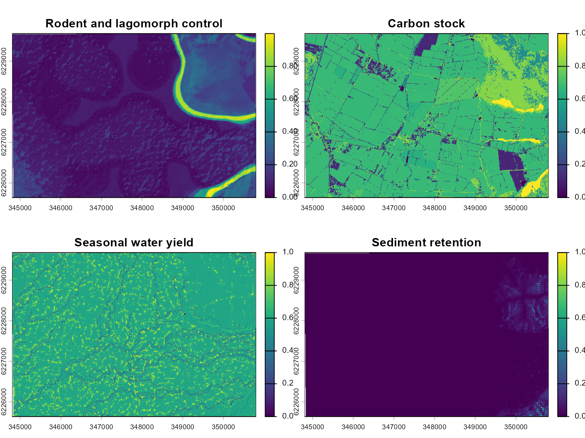
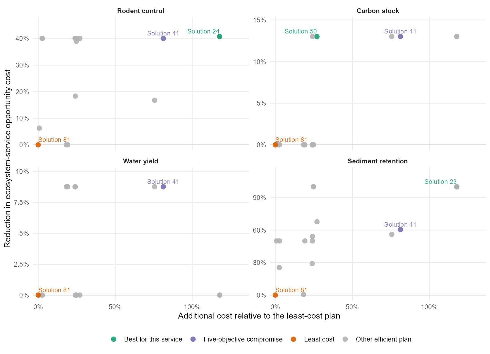
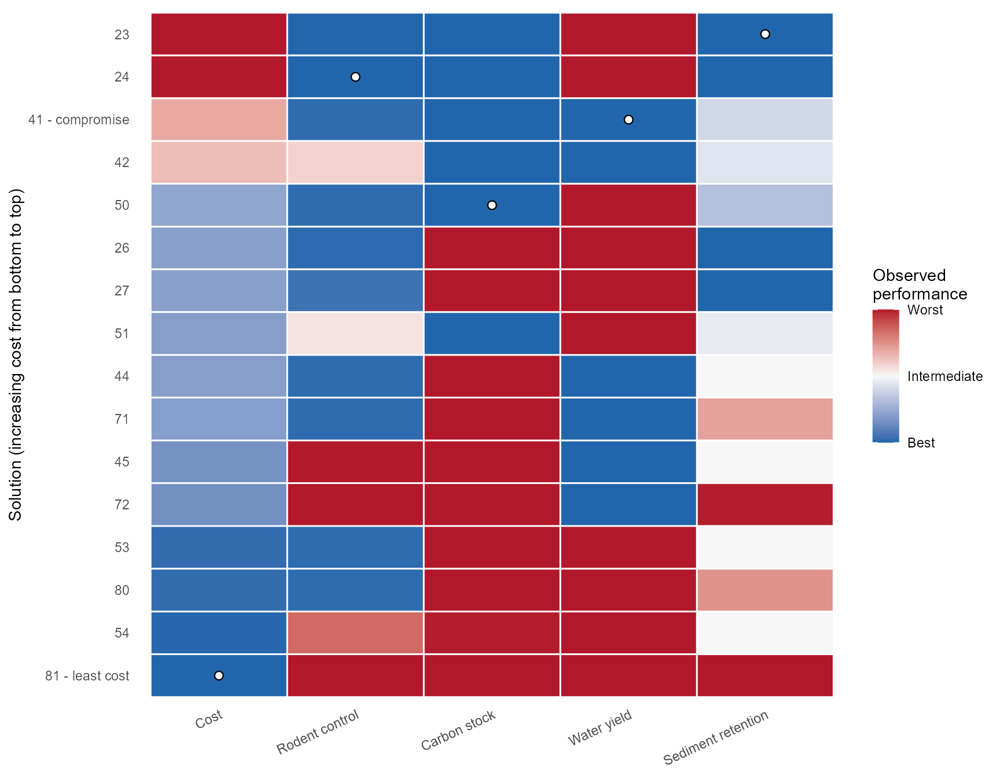
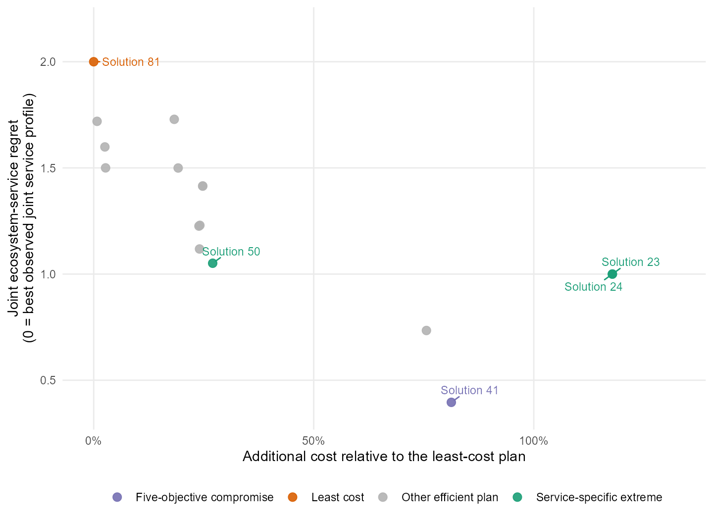
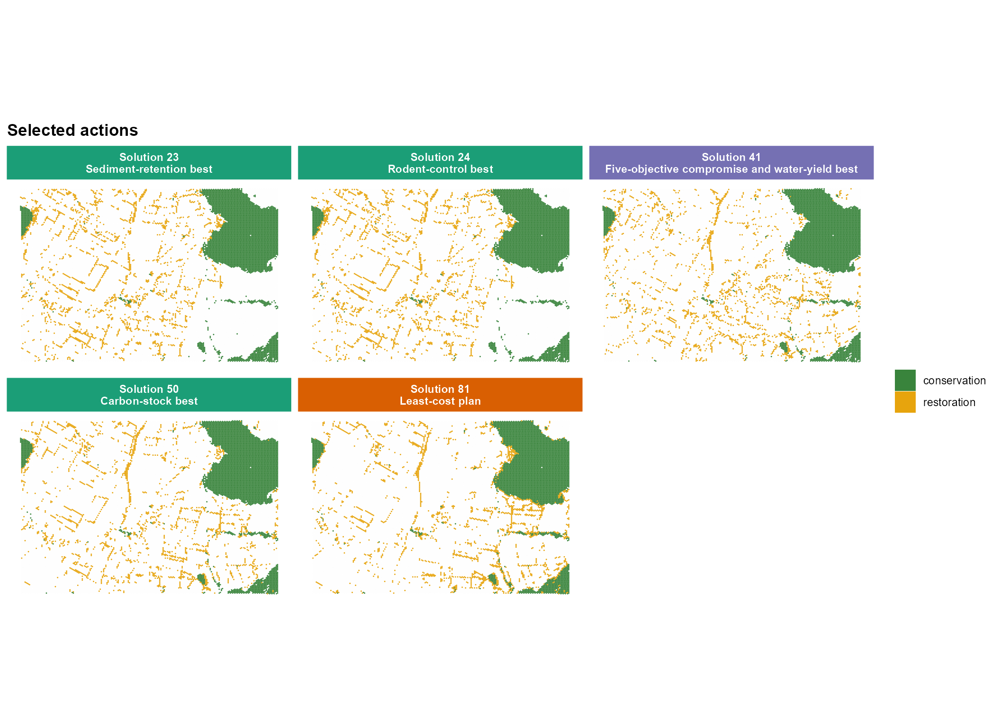
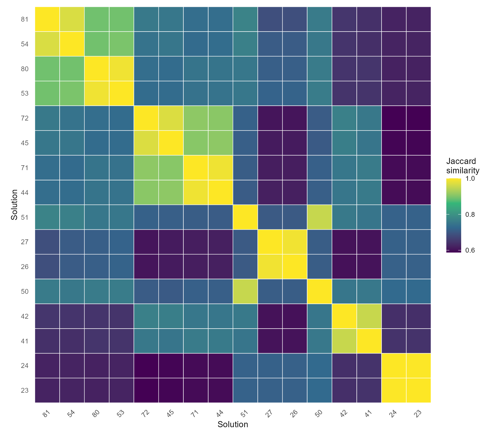

# Multi-objective forest restoration planning in a highly productive landscape

## Overview

Restoration planning is especially difficult in highly productive
landscapes. Most land is already committed to agriculture, forestry, or
other economically valuable uses, so restoration cannot be treated as
though it were being placed on vacant land. Every new restoration site
competes with an existing use, requires public or private expenditure,
and may alter areas that already provide important ecosystem services.

At the same time, ecosystem-service provision is often uneven across the
landscape. Some locations already store substantial carbon, regulate
water flows, retain sediment, or support biological control, whereas
other locations provide comparatively little of these functions. In this
example, the planning goal is therefore not to restore the sites with
the highest current service values. Instead, it is to identify eligible
sites with relatively low baseline levels of ecosystem services. These
low-service locations are interpreted as areas of current ecological
deficit where restoration may be most justified, while avoiding the
displacement of functions that are already being supplied elsewhere.

This creates a genuine many-objective problem. A site with low carbon
stock may still have high seasonal water yield, and a site with low
sediment retention may be important for rodent and lagomorph control.
Moreover, the least expensive sites are not necessarily those with the
largest ecosystem-service deficits. Collapsing the four services into a
single index would hide these conflicts and would require fixed exchange
weights before decision makers have seen their consequences.

This vignette uses `multiscape` to extend an existing conservation
network with a fixed amount of forest restoration. Existing conservation
areas are treated as prior commitments and remain unchanged. The
optimizer decides where to add restoration within the surrounding
productive matrix while balancing five separate objectives:
implementation cost and the baseline levels of four ecosystem services
inside the selected restoration portfolio.

The example addresses the following planning question:

> Which additional sites should be restored to complete the landscape
> commitment at low cost, while directing restoration towards locations
> with comparatively low current provision of multiple ecosystem
> services?

The analysis produces a set of alternative spatial plans rather than one
predefined answer. These alternatives show how the restoration pattern
changes when greater emphasis is placed on different ecosystem-service
deficits.

## Planning formulation

Let \\i \in \mathcal{I}\_R\\ index planning units that are eligible for
forest restoration. The binary decision variable \\r_i\\ equals one when
unit \\i\\ is selected for restoration and zero otherwise. The existing
conservation network is fixed in every solution. It provides the spatial
foundation of the plan, but the decisions compared in this vignette
concern only the additional restoration units.

The total restoration cost is

\\ C(r)=\sum\_{i \in \mathcal{I}\_R}c_i^R r_i, \\

where \\c_i^R\\ is the local cost of restoring unit \\i\\.

For each ecosystem service \\f\\, the model also minimizes

\\ O_f(r)=\sum\_{i \in \mathcal{I}\_R}q\_{if}r_i, \\

where \\q\_{if}\\ is the normalized baseline amount of service \\f\\
currently provided by unit \\i\\. This quantity can be interpreted as
the total baseline service level contained in the selected restoration
portfolio. Minimizing it directs restoration towards units with lower
current provision of that service.

This interpretation is important. A low value does not mean that a site
is ecologically unimportant, nor does it prove that restoration will
generate a large future gain. It indicates only that the site is
comparatively deficient in the service represented by that layer and
that selecting it avoids placing restoration in areas where that service
is already strongly expressed.

The complete objective vector is

\\ \min \left\\ C(r), O\_{\mathrm{control}}(r), O\_{\mathrm{carbon}}(r),
O\_{\mathrm{water}}(r), O\_{\mathrm{sediment}}(r) \right\\. \\

The four ecosystem-service objectives are retained separately because
their spatial patterns differ. The model therefore searches for low-cost
restoration portfolios that target several types of ecological deficit
without assuming that one unit of carbon, water yield, sediment
retention, and biological control are directly interchangeable.

These objectives describe baseline conditions at candidate restoration
sites. They do not estimate the changes caused by restoration.
Consequently,
[`add_effects()`](https://josesalgr.github.io/multiscape/reference/add_effects.md)
is not required here. A model intended to predict post- restoration
gains would need action-specific effects and one or more benefit
objectives.

## Landscape and ecosystem-service data

The example represents a highly productive landscape divided into 30,496
planning units. Within this matrix, only a subset of units is available
for new forest restoration, while other units are already conserved or
excluded from intervention.

Four normalized raster layers describe current ecosystem-service
provision: rodent and lagomorph control, carbon stock, seasonal water
yield, and sediment retention. Values range from 0 to 1 within each
layer. Higher values indicate stronger current provision of the
corresponding service; lower values indicate areas where that service is
comparatively weak and where restoration may help address an existing
ecological deficit.

``` r

library(multiscape)
library(dplyr)
library(ggplot2)
library(terra)

data("sim_pu_sf", package = "multiscape")
ecosystem_services <- load_sim_features_raster()

service_labels <- c(
  L1_control_inv = "Rodent and lagomorph control",
  L1_stock_inv = "Carbon stock",
  L1_rend_inv = "Seasonal water yield",
  L1_reten_inv = "Sediment retention"
)

nrow(sim_pu_sf)
#> [1] 30496
names(ecosystem_services)
#> [1] "L1_control_inv" "L1_stock_inv"   "L1_rend_inv"    "L1_reten_inv"
```

The maps show that the four deficits do not occur in the same places. An
area with low carbon stock may not have low water yield, and an area
with weak sediment retention may still contribute substantially to
biological control. This lack of spatial congruence is the central
reason for retaining four separate objectives. A restoration plan that
performs well for one service can still redirect intervention towards
high-value areas for another.

``` r

names(ecosystem_services) <- unname(service_labels[names(ecosystem_services)])
terra::plot(ecosystem_services)
```



``` r

names(ecosystem_services) <- names(service_labels)
```

## Define the restoration decision context

The planning-unit attributes divide the landscape into three management
roles. Units marked `locked_in` constitute the existing conservation
network and are included in every plan. Units that are neither locked in
nor locked out form the candidate pool for additional forest
restoration. Units marked `locked_out` are unavailable because of
land-use, institutional, or other planning restrictions represented in
the example.

The action table includes both conservation and restoration so that the
final maps display the complete intervention system. However, only
restoration is a variable decision. The conservation network is
inherited from previous policy commitments and remains spatially fixed
across all solutions.

``` r

planning_attributes <- sim_pu_sf |>
  sf::st_drop_geometry() |>
  select(id, cost, area, locked_in, locked_out)

actions <- data.frame(
  id = c("conservation", "restoration"),
  name = c("Conservation", "Restoration")
)

conservation_units <- planning_attributes |>
  filter(locked_in) |>
  transmute(pu = id, action = "conservation")

restoration_units <- planning_attributes |>
  filter(!locked_in, !locked_out) |>
  transmute(pu = id, action = "restoration")

feasible_actions <- bind_rows(
  conservation_units,
  restoration_units
)

action_costs <- feasible_actions |>
  left_join(
    planning_attributes |> select(id, cost),
    by = c("pu" = "id")
  )

feasible_actions |> count(action)
#>         action     n
#> 1 conservation  3988
#> 2  restoration 25089
```

The problem is therefore not a competition between conservation and
restoration inside the same planning unit. It is a network-completion
problem: given an existing conservation foundation, which additional
units should be restored to meet the remaining area commitment?

This distinction also clarifies the role of the many-objective analysis.
AUGMECON does not decide whether existing conservation should be
replaced. It compares alternative ways of placing the same amount of new
restoration across the eligible productive matrix.

## Build the planning problem

[`create_problem()`](https://josesalgr.github.io/multiscape/reference/create_problem.md)
links the planning-unit geometries to the four ecosystem- service layers
and stores the baseline amount of each service in every unit.
[`add_actions()`](https://josesalgr.github.io/multiscape/reference/add_actions.md)
then registers the feasible conservation and restoration assignments and
their associated local costs.

The planning-unit cost field remains available in the problem object for
inspection. The optimization objective, however, uses the explicit
action costs defined for restoration. This avoids counting the same cost
component twice.

``` r

problem <- create_problem(
  pu = sim_pu_sf,
  features = ecosystem_services,
  cost = "cost"
) |>
  add_actions(
    actions = actions,
    include_pairs = feasible_actions,
    cost = action_costs
  )
```

The landscape-level commitment is set at 20% of all 30,496 planning
units. The existing conservation network already contributes 3,988 units
towards this commitment. The remaining gap is therefore 2,112 units,
which must be supplied through new forest restoration.

Every solution selects exactly these 2,112 restoration units. Holding
restoration area constant is essential for interpretation: differences
in cost or ecosystem-service objectives arise from *where* restoration
is allocated, not from one solution restoring more land than another.
Because all planning units have the same area, an equality constraint
with a tolerance smaller than one unit enforces the same restoration
effort in every plan.

No feature-representation target is imposed. The policy requirement
concerns the amount of land restored, while the four ecosystem-service
layers are used to compare alternative locations for that fixed effort.

``` r

unit_area <- stats::median(sim_pu_sf$area)
total_commitment_units <- ceiling(0.20 * nrow(sim_pu_sf))
restoration_target_units <- total_commitment_units - nrow(conservation_units)
restoration_target_area <- restoration_target_units * unit_area

problem <- problem |>
  add_constraint_area(
    area = restoration_target_area,
    sense = "equal",
    tolerance = 0.25 * unit_area,
    actions = "restoration"
  ) |>
  add_constraint_locked_planning_units(
    locked_in = "locked_in",
    locked_out = "locked_out"
  )
```

## Register five restoration objectives

The model registers five atomic objectives, each of which retains a
distinct interpretation.

The first objective minimizes the explicit cost of the selected
restoration actions. The other four objectives minimize the current
amount of each ecosystem service contained within the restoration
portfolio. In practical terms, they encourage the optimizer to direct
restoration towards sites with low baseline carbon stock, low seasonal
water yield, low sediment retention, or low rodent and lagomorph
control.

Each ecosystem-service objective is restricted to the `restoration`
action. The fixed conservation network is therefore visible in the maps
but does not add a constant value to every solution. This makes the
reported objective values directly comparable as properties of the
additional restoration portfolio.

Keeping the four services separate is deliberate. A site selected
because it has low carbon stock may still have high water yield, so no
single restoration portfolio is expected to minimize all four service
totals simultaneously.

``` r

problem <- problem |>
  add_objective_min_cost(
    alias = "cost",
    include_pu_cost = FALSE,
    include_action_cost = TRUE,
    actions = "restoration"
  ) |>
  add_objective_min_intervention_impact(
    features = "L1_control_inv",
    actions = "restoration",
    alias = "rodent_control"
  ) |>
  add_objective_min_intervention_impact(
    features = "L1_stock_inv",
    actions = "restoration",
    alias = "carbon_stock"
  ) |>
  add_objective_min_intervention_impact(
    features = "L1_rend_inv",
    actions = "restoration",
    alias = "water_yield"
  ) |>
  add_objective_min_intervention_impact(
    features = "L1_reten_inv",
    actions = "restoration",
    alias = "sediment_retention"
  )

print(problem)
```

## Generate alternatives with AUGMECON

The purpose of the analysis is to reveal the consequences of alternative
restoration priorities before decision makers specify a preferred
trade-off. A weighted-sum model would require weights for cost and the
four services at the outset. Those weights would embed an exchange rule
before stakeholders had seen how it changes the spatial plan.

AUGMECON is used instead as an a posteriori method. Cost is treated as
the primary objective, while the four ecosystem-service objectives
become explicit epsilon constraints. Each run asks a different version
of the same management question: what is the least-cost restoration
portfolio that also satisfies a particular combination of limits on the
baseline services contained in the selected sites?

`set_runs_grid(3)` constructs three epsilon levels for each of the four
secondary objectives from their payoff ranges. Their Cartesian product
produces \\3^4=81\\ requested configurations. These configurations
sample contrasting combinations of ecosystem-service requirements, from
relatively permissive limits to combinations that force restoration
strongly towards low-service areas.

The grid is intentionally small for a vignette involving more than
30,000 planning units. It is sufficient to demonstrate the
many-objective workflow, but it should not be interpreted as an
exhaustive representation of the five-dimensional Pareto frontier. A
decision-support application could refine the grid or introduce
policy-defined thresholds with
[`set_runs_manual()`](https://josesalgr.github.io/multiscape/reference/set_runs_manual.md).

Lexicographic anchoring is used to construct the payoff table, and the
AUGMECON augmentation rewards unused slack after cost has been
optimized. This helps avoid weakly efficient plans that improve one
criterion only trivially while performing unnecessarily poorly on
others.

Some combinations of stringent service limits may be infeasible. In this
context, infeasibility has a substantive interpretation: the fixed
restoration area cannot always be concentrated simultaneously in
locations with very low levels of all four services. Such runs reveal
conflicts among the spatial deficits rather than representing a failure
of the analysis.

``` r

problem <- problem |>
  set_method_augmecon(
    primary = "cost",
    aliases = objective_aliases,
    runs = set_runs_grid(3),
    lexicographic = TRUE,
    augmentation = 1e-3,
    control = set_runs_control(
      stop_on_infeasible = FALSE,
      stop_on_no_solution = FALSE
    )
  ) |>
  set_solver_gurobi(gap_limit = 0)
```

The complete optimization requires Gurobi and a valid licence. It took
about 18 minutes on the system used to prepare this vignette. Re-solving
all 81 configurations whenever the vignette or package website is built
would add substantial and unnecessary computational cost.

The vignette therefore loads a precomputed `SolutionSet`. This object
preserves the action assignments, objective values, solver status, and
run metadata needed for the remaining analysis.

``` r

solutions <- readRDS(file.path(
  "data",
  "integrated-ecosystem-services-solutions.rds"
))
```

The code below shows how to regenerate and save the complete solution
set after changing the formulation, run design, or solver configuration.
It is displayed for reproducibility but is not evaluated during ordinary
vignette or `pkgdown` builds.

``` r

solutions <- solve(problem)

saveRDS(
  solutions,
  file.path("data", "integrated-ecosystem-services-solutions.rds"),
  compress = "xz"
)
```

## Examine the many-objective solution set

### Run design and objective values

The run table records the 81 requested combinations of ecosystem-service
thresholds. A run describes an attempted model configuration; it does
not necessarily have an associated solution. Some configurations may be
infeasible, while several feasible configurations may lead to the same
spatial allocation because the decision variables are discrete.

For interpretation, the complete result is filtered to feasible,
non-dominated solutions and repeated decision vectors are removed. The
resulting `SolutionSet` contains the distinct efficient restoration
portfolios generated by this experiment.

``` r

efficient_solutions <- solutions |>
  solution_filter(feasible_only = TRUE, nondominated = TRUE) |>
  solution_unique(by = "decisions")

run_summary <- data.frame(
  requested_configurations = nrow(get_runs(solutions)),
  retained_efficient_plans = nrow(get_runs(efficient_solutions))
)
run_summary
#>   requested_configurations retained_efficient_plans
#> 1                       81                       16

get_runs(efficient_solutions)
#>    run_id solution_id  status     runtime          gap
#> 1      23          23 optimal   1.2710001 0.000000e+00
#> 2      24          24 optimal   2.1499999 0.000000e+00
#> 3      26          26 optimal   1.0330000 1.060691e-14
#> 4      27          27 optimal   2.2810001 9.624842e-15
#> 5      41          41 optimal 261.4949999 0.000000e+00
#> 6      42          42 optimal   8.2400000 0.000000e+00
#> 7      44          44 optimal 100.7430000 4.346440e-15
#> 8      45          45 optimal  19.3859999 4.729136e-15
#> 9      50          50 optimal   4.0480001 0.000000e+00
#> 10     51          51 optimal   0.9520001 1.184638e-15
#> 11     53          53 optimal   5.0090001 3.818109e-15
#> 12     54          54 optimal   1.1499999 0.000000e+00
#> 13     71          71 optimal  38.7410002 3.362206e-15
#> 14     72          72 optimal  15.8169999 6.628831e-15
#> 15     80          80 optimal   1.5079999 5.496960e-15
#> 16     81          81 optimal   0.3240001 0.000000e+00
get_objectives(efficient_solutions, format = "wide")
#>    solution_id     cost rodent_control carbon_stock water_yield
#> 1           23 258716.2       1495.492     8711.409   10027.200
#> 2           24 258701.0       1493.568     8711.404   10027.187
#> 3           26 148168.2       1511.004    10014.317   10027.200
#> 4           27 148167.4       1539.062    10014.318   10027.200
#> 5           41 215254.0       1511.468     8711.411    9148.542
#> 6           42 208536.5       2098.464     8711.411    9148.542
#> 7           44 147312.3       1511.469    10014.300    9148.542
#> 8           45 141545.5       2520.960    10014.303    9148.543
#> 9           50 150860.0       1511.470     8711.403   10027.165
#> 10          51 147406.2       2058.816     8711.412   10027.080
#> 11          53 121961.2       1511.469    10014.318   10027.198
#> 12          54 119665.0       2362.490    10009.051   10027.176
#> 13          71 147154.9       1511.467    10014.300    9148.543
#> 14          72 140495.7       2521.595    10014.310    9148.543
#> 15          80 121774.2       1511.470    10014.311   10027.172
#> 16          81 118753.5       2521.662    10014.318   10027.201
#>    sediment_retention
#> 1        5.511997e-07
#> 2        7.745541e-07
#> 3        6.396928e-07
#> 4        6.396928e-07
#> 5        2.858626e+01
#> 6        3.174687e+01
#> 7        3.613481e+01
#> 8        3.613296e+01
#> 9        2.334568e+01
#> 10       3.310843e+01
#> 11       3.613522e+01
#> 12       3.613518e+01
#> 13       5.123982e+01
#> 14       7.186292e+01
#> 15       5.388135e+01
#> 16       7.227048e+01
```

The reduction from 81 requested configurations to a smaller set of
unique efficient plans is expected. Nearby epsilon combinations can
select the same 2,112 restoration units, dominated solutions add no new
trade-off information, and some combinations of very restrictive service
limits cannot be achieved simultaneously.

The retained plans should therefore be read as a set of substantively
different restoration strategies, not as 81 equally distinct
alternatives.

### Read the solution set as a sequence of decisions

Five-dimensional trade-offs are difficult to understand from a complete
matrix of pairwise plots alone. The following diagnostics organize the
results around a simpler management question:

> How much additional expenditure is required to move restoration away
> from sites with high current ecosystem-service provision and towards
> sites with lower baseline service levels?

All five objectives are minimized. Accordingly, an improvement in an
ecosystem- service objective means that the selected restoration
portfolio contains less of that service at baseline than the least-cost
portfolio. In the logic of this example, the plan is targeting a
stronger current deficit for that service. It does **not** mean that the
service has already increased after restoration.

#### How much deficit targeting accompanies additional cost?

Each panel compares an efficient plan with the least-cost restoration
plan, which is located at zero on both axes. Moving to the right means
accepting a higher implementation cost. Moving upwards means reducing
the baseline amount of the corresponding ecosystem service inside the
selected restoration sites.

A higher point therefore represents a portfolio that directs restoration
more strongly towards locations where that service is currently low.
Separate vertical scales are retained because the observed percentage
range differs among services and because equal percentage changes need
not have equal ecological or policy significance.

A point below zero would indicate that a more expensive plan selects
sites with a higher baseline level of that service than the least-cost
plan.



The points are not connected because they represent alternative spatial
portfolios, not successive stages of one restoration trajectory. Labels
identify the least-cost plan, the five-objective compromise, and the
best observed plan for the service shown in each panel. The same
solution identifiers are used in the later heatmap and maps.

The figure should first be read within each panel. A steep increase
indicates that a relatively small additional expenditure can redirect
restoration towards a substantially stronger deficit for that service. A
long movement to the right with little vertical improvement indicates
declining returns. Comparing panels then reveals whether the same costly
plan addresses several deficits or whether each service requires a
different spatial allocation.

Because the services are not aggregated, the graph preserves the central
planning conflict: restoration sites that are attractive for one
ecological reason may be unattractive for another.

#### Compare the complete performance profile of each plan

The heatmap summarizes the full five-objective profile of every retained
plan. Solutions are ordered from lowest to highest cost. Within each
objective column, values are normalized across the observed efficient
set. Blue indicates the best observed value for a minimized objective,
red the worst, and intermediate colours show relative performance
between those extremes.

This normalization supports visual comparison but does not make the
objectives commensurable. It does not imply that cost and ecosystem
services share units, or that the four services should receive equal
policy weight.



White circles identify the best observed plan for each objective. Rows
with blue cells across several service columns represent restoration
portfolios that simultaneously target multiple ecosystem-service
deficits. Rows that combine blue and red cells expose specialization:
the plan performs strongly for some services by accepting weaker
performance for others.

The cost column completes the story. It shows whether a portfolio that
targets several ecological deficits can be obtained with a moderate
budget increase or whether it requires a substantially more expensive
spatial reallocation.

### Identify extremes and representative compromises

[`frontier_extremes()`](https://josesalgr.github.io/multiscape/reference/frontier_extremes.md)
identifies the best and worst observed solution for each objective.
These extremes are useful reference points because they show the maximum
contrast generated by the experiment. However, the plan that best
targets one ecosystem-service deficit may be costly or may select sites
with high baseline values of another service.

``` r

  extremes <- frontier_extremes(
    efficient_solutions,
    objectives = objective_aliases,
    ties = "first"
  )
  extremes
#>    solution_id          objective sense bound  role        value
#> 1           81               cost   min   min  best 1.187535e+05
#> 2           23               cost   min   max worst 2.587162e+05
#> 3           24     rodent_control   min   min  best 1.493568e+03
#> 4           81     rodent_control   min   max worst 2.521662e+03
#> 5           50       carbon_stock   min   min  best 8.711403e+03
#> 6           81       carbon_stock   min   max worst 1.001432e+04
#> 7           41        water_yield   min   min  best 9.148542e+03
#> 8           81        water_yield   min   max worst 1.002720e+04
#> 9           23 sediment_retention   min   min  best 5.511997e-07
#> 10          81 sediment_retention   min   max worst 7.227048e+01
```

With five objectives, a two-dimensional geometric knee is not
appropriate. `frontier_knee(method = "ideal")` instead identifies the
observed plan closest to the normalized five-objective ideal. The ideal
combines the best observed value of every criterion, even though no
single feasible plan may attain all of them simultaneously.

The resulting plan is a descriptive compromise within the generated
solution set. It is not a universally optimal restoration strategy and
does not replace stakeholder preferences.

For ecological interpretation, the analysis also calculates distance to
an ideal defined only by the four ecosystem-service objectives. We refer
to this as *joint ecosystem-service regret*. A value of zero would mean
that one plan simultaneously attains the best observed baseline-service
total for all four services. Larger values indicate increasing distance
from that joint deficit- targeting profile.

Plotting this distance against additional cost keeps the financial and
ecological dimensions visible. Because each service is normalized to its
observed range, the diagnostic gives the four services equal influence.
This equal weighting is used only to describe the generated
alternatives; it does not alter the AUGMECON formulation.

``` r

  service_distances <- frontier_distances(
    efficient_solutions,
    objectives = service_aliases,
    reference = "ideal"
  )
  service_distances$cost <- objective_values$cost[
    match(service_distances$solution_id, objective_values$solution_id)
  ]
  service_distances$additional_cost <- 100 * (
    service_distances$cost / minimum_cost - 1
  )

  ecological_id <- service_distances$solution_id[
    which.min(service_distances$distance_to_ideal)
  ]
  specialist_id <- unname(service_best_ids[["sediment_retention"]])

  compromise[, c(
    "solution_id",
    objective_aliases,
    "knee_score",
    "knee_rank"
  )]
#>   solution_id   cost rodent_control carbon_stock water_yield sediment_retention
#> 1          41 215254       1511.468     8711.411    9148.542           28.58626
#>   knee_score knee_rank
#> 1   0.644435         1

  data.frame(
    five_objective_compromise = compromise_id,
    closest_to_ecological_ideal = ecological_id,
    same_solution = compromise_id == ecological_id
  )
#>   five_objective_compromise closest_to_ecological_ideal same_solution
#> 1                        41                          41          TRUE
```

In this experiment, the five-objective compromise and the plan closest
to the four-service ideal are both solution 41. This agreement is an
empirical feature of the generated set, not a property guaranteed by
AUGMECON.

The figure also highlights the best observed plan for each individual
service. Because solution 41 is simultaneously the water-yield extreme,
the highlighted roles correspond to the same five unique plans mapped
below. The colour scheme is retained across figures: orange represents
the least-cost plan, magenta the joint compromise, and green a
service-specific extreme.



## Connect objective performance to spatial decisions

Objective values describe how a plan performs, but they do not show
which parts of the productive landscape would actually change. The maps
therefore compare the least-cost plan, the best plan for each
ecosystem-service objective, and the five-objective compromise.

Because the compromise is also the best observed plan for water yield,
the set contains five unique spatial allocations rather than six.
Together they represent three distinct planning logics: minimizing
expenditure, targeting a particular ecosystem-service deficit, and
balancing cost with all four deficits.

    #>                                             role solution_id
    #> 1                                Least-cost plan          81
    #> 2 Five-objective compromise and water-yield best          41
    #> 3                            Rodent-control best          24
    #> 4                              Carbon-stock best          50
    #> 5                        Sediment-retention best          23
    #>   additional_cost_percent rodent_control_reduction_percent
    #> 1                     0.0                              0.0
    #> 2                    81.3                             40.1
    #> 3                   117.8                             40.8
    #> 4                    27.0                             40.1
    #> 5                   117.9                             40.7
    #>   carbon_stock_reduction_percent water_yield_reduction_percent
    #> 1                              0                           0.0
    #> 2                             13                           8.8
    #> 3                             13                           0.0
    #> 4                             13                           0.0
    #> 5                             13                           0.0
    #>   sediment_retention_reduction_percent
    #> 1                                  0.0
    #> 2                                 60.4
    #> 3                                100.0
    #> 4                                 67.7
    #> 5                                100.0

Positive percentages in the service columns represent reductions in
baseline service levels inside the restoration portfolio relative to the
least-cost plan. For example, a positive carbon-stock value means that
the plan restores sites with lower current carbon stock than those
selected by the least-cost portfolio. It should not be interpreted as a
measured increase in carbon after restoration.

The table provides the numerical context for the maps by showing the
additional cost required to achieve each spatial redirection.



The maps reveal the spatial mechanism behind the objective trade-offs.
They show whether improved targeting of a service deficit is achieved
through a small number of local substitutions or through a broader
relocation of the restoration portfolio across the landscape.

Because the conservation network is fixed, all differences among panels
arise from the 2,112 restoration decisions. Comparing the
service-specific extremes shows whether different deficits point to
common restoration areas or to contrasting parts of the productive
matrix. The compromise map identifies the allocation that balances these
competing spatial signals rather than optimizing one of them in
isolation.

## Compare decision-space similarity

Two plans can have similar objective values while selecting different
places. Jaccard similarity complements the performance diagnostics by
measuring overlap in selected planning-unit–action pairs.

The heatmap follows the same cost ordering used above. Higher similarity
means that two plans prescribe more of the same spatial actions. Exact
duplicate decision vectors have already been removed, so values close to
one indicate very similar but not necessarily identical portfolios.

The fixed conservation network contributes the same assignments to every
solution and can therefore raise overall similarity. Differences among
plans are generated only by the variable restoration component.
Consequently, the heatmap should be interpreted as similarity of the
complete intervention system in a setting where one large component is
intentionally held constant.



Selection frequency provides a more local view of stability. It reports
how often each planning-unit–action assignment appears across the
retained non-dominated solutions.

For restoration units, a high frequency indicates that a location is
selected under many different combinations of cost and ecosystem-service
limits. Such a site is comparatively robust to the trade-off
configuration explored here. For conservation units, frequency one is
expected because those assignments are locked into every solution.

Frequency is therefore a measure of stability within this generated
solution set. It should not be interpreted as ecological
irreplaceability, restoration success, or the probability that a site is
objectively optimal.

``` r

  assignment_frequency <- selection_frequency(efficient_solutions)

  head(
    assignment_frequency[
      order(-assignment_frequency$frequency),
    ],
    15
  )
#>        pu       action n_selected n_solutions frequency
#> 83  10075  restoration         16          16         1
#> 109 10099  restoration         16          16         1
#> 196 10180  restoration         16          16         1
#> 198 10182  restoration         16          16         1
#> 226 10208  restoration         16          16         1
#> 227 10209  restoration         16          16         1
#> 283  1026 conservation         16          16         1
#> 338 10314  restoration         16          16         1
#> 387 10360  restoration         16          16         1
#> 388 10361  restoration         16          16         1
#> 646 10605  restoration         16          16         1
#> 651 10610  restoration         16          16         1
#> 786 10736  restoration         16          16         1
#> 840 10786  restoration         16          16         1
#> 978 10919  restoration         16          16         1
```

## Interpretation and limitations

This vignette demonstrates how `multiscape` can prioritize additional
forest restoration in a highly productive landscape where land is
scarce, existing uses matter, and ecosystem-service deficits are
spatially heterogeneous. The existing conservation network is treated as
fixed, and every alternative adds the same 2,112 restoration units. The
decision problem is therefore entirely about spatial allocation: which
parts of the productive matrix should be restored?

The formulation gives a specific answer to that question. It favours
locations with low implementation cost and low current levels of four
ecosystem services. These low-service locations are treated as areas of
ecological deficit, making them plausible candidates for restoration
while avoiding sites where important functions are already strongly
provided. By retaining the services as separate objectives, the model
shows that there is no single universal map of ecological need: carbon,
water, sediment retention, and biological control can point to different
restoration priorities.

This interpretation must remain within the limits of the data and
formulation. Low baseline service provision is not equivalent to high
restoration potential. A degraded site may respond strongly to
intervention, weakly, or only after a long time. Conversely, a site with
high current service provision could still benefit from restoration. The
model identifies where current service deficits and implementation costs
favour intervention; it does not predict the ecological response
produced by that intervention.

A more complete application could combine the present deficit-based
objectives with action-specific estimates of expected restoration gain,
feasibility, time to recovery, land-use opportunity cost, connectivity,
or future climate risk. Those additions would distinguish more
explicitly between *where services are currently low* and *where
restoration is expected to improve them most*.

Finally, the generated alternatives depend on the epsilon design. The 81
requested boundary configurations provide a transparent first
exploration of the five-dimensional trade-off space, not an exhaustive
approximation of the Pareto frontier. A real decision process should
refine the thresholds around policy-relevant regions, test the stability
of the spatial recommendations, and use stakeholder input to identify
acceptable compromises after the consequences of the alternatives have
been made visible.
