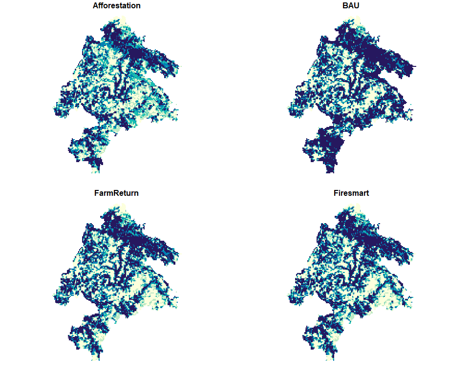
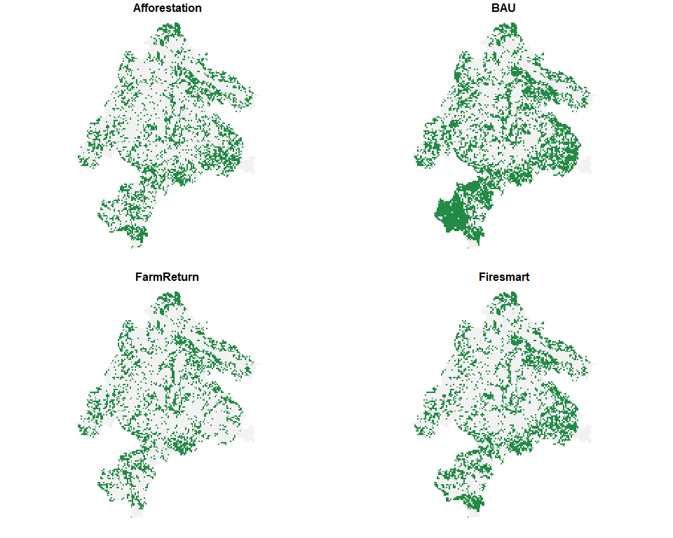
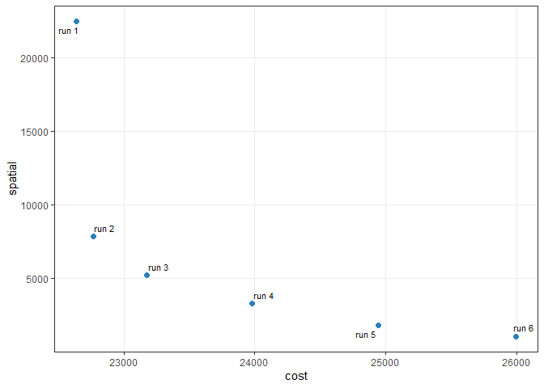

# Multi-action, multi-objective spatial planning in R

`multiscape` is an exact optimisation framework for **multi-action,
multi-objective spatial planning in R**. It addresses planning problems
in which management actions are explicit decision alternatives whose
spatial allocation must satisfy planning requirements while accounting
for multiple competing objectives. Building on the transition from
place-based prioritisation towards spatially explicit action planning
([Tallis et al., 2021](https://doi.org/10.1111/nyas.14651);
[Salgado-Rojas et al., 2023](https://doi.org/10.1111/2041-210X.14220)),
`multiscape` jointly represents **where management actions can be
implemented, which actions are selected, and the consequences expected
from those decisions**.

Planning units, features, feasible actions, action-specific costs and
outcomes, and spatial or management constraints are represented within a
mixed-integer linear programming (MILP) formulation. Multiple objectives
are defined independently, allowing ecological, economic, and spatial
criteria to remain explicit rather than being collapsed a priori into a
single criterion. Alternative spatial plans can then be generated and
compared to characterise trade-offs among objectives and the
corresponding spatial allocation of management actions. This formulation
supports conservation and restoration applications as well as broader
multiple-use spatial planning problems involving ecological, economic,
and social objectives ([Neubert et al.,
2025](https://doi.org/10.1016/j.tree.2025.09.007)).

## Installation

Install the released version of `multiscape` from [Comprehensive R
Archive Network (CRAN)](https://cran.r-project.org/package=multiscape):

``` r

install.packages("multiscape")
```

Alternatively, install the latest development version from
[GitHub](https://github.com/josesalgr/multiscape):

``` r

if (!requireNamespace("remotes", quietly = TRUE)) {
  install.packages("remotes")
}
remotes::install_github("josesalgr/multiscape")
```

## Getting started

### Multi-action planning in the Meseta Ibérica

We illustrate the `multiscape` workflow using a spatial planning problem
from Spain’s Meseta Ibérica, adapted from [Cánibe Iglesias et
al. (2025)](https://doi.org/10.1016/j.ecoser.2025.101742). The example
comprises **11,109 planning units**, **151 species**, four
ecosystem-service features, and four alternative management actions:
**Afforestation**, **BAU**, **FarmReturn**, and **Firesmart**.

### Understand the planning inputs

Before constructing the optimisation problem, we examine its spatial
units, features, management alternatives, implementation costs, and
expected outcomes. The example data are included in `multiscape` and can
be loaded directly.

``` r

library(multiscape)
meseta <- load_meseta()
```

#### Planning units

The study area is divided into 11,109 planning units of approximately 1
km². Each unit represents a location where a management action may be
implemented. The supplied spatial polygons and identifiers are stored in
`planning_units`.

``` r

head(meseta$planning_units)
#> Simple feature collection with 6 features and 2 fields
#> Geometry type: POLYGON
#> Dimension:     XY
#> Bounding box:  xmin: 2936400 ymin: 2279200 xmax: 2945400 ymax: 2281200
#> Projected CRS: GRS_1980_IUGG_1980_Lambert_Azimuthal_Equal_Area
#>   id                       geometry cost
#> 1  1 POLYGON ((2944400 2280200, ...  0.1
#> 2  2 POLYGON ((2945400 2280200, ...  0.1
#> 3  3 POLYGON ((2937400 2279200, ...  0.1
#> 4  4 POLYGON ((2938400 2279200, ...  0.1
#> 5  5 POLYGON ((2939400 2279200, ...  0.1
#> 6  6 POLYGON ((2944400 2279200, ...  0.1
```

#### Features and reference amounts

The planning problem considers 155 features: 151 species and four
ecosystem services. A **feature** is a measurable quantity represented
in the planning model. The `features` table identifies these quantities,
while `dist_features` provides their **reference amounts** by planning
unit and feature. These amounts serve as the comparison values for
action-specific outcomes; they do not define management decisions or
representation targets.

``` r

head(meseta$features)
#>   id    name
#> 1  1 ACCGENT
#> 2  2 ACCNISU
#> 3  3 ACRARUN
#> 4  4 ACRSCIR
#> 5  5 AEGCAUD
#> 6  6     AER
```

In this example, `dist_features` assigns zero credited representation to
the reference. Representation is instead credited through the outcomes
associated with selected actions.

#### Management actions and implementation costs

Four alternative actions can be implemented throughout the study area:
**Afforestation**, **BAU**, **FarmReturn**, and **Firesmart**. Their
implementation costs vary by planning unit, so a plan’s cost depends on
**which actions are chosen and where they are implemented**.

``` r

meseta$actions
#>   id          name
#> 1  1 Afforestation
#> 2  2           BAU
#> 3  3    FarmReturn
#> 4  4     Firesmart
```

``` r

plot(
  meseta$maps$costs,
  main = "Action-specific implementation costs",
  border = NA,
  pal = function(n) hcl.colors(n, "YlGnBu", rev = TRUE)
)
```



#### Action-specific outcomes

The same feature may respond differently to different management actions
and locations. The `outcomes` table supplies its expected representation
for each recorded planning-unit, feature, and action combination. In
this dataset, outcomes are binary: a value of 1 credits one unit of
representation, while unrecorded combinations contribute zero. This
coding also applies to the included ecosystem-service features.

``` r

head(meseta$outcomes)
#>   pu feature outcome action
#> 1  1       7       1      1
#> 2  1       8       1      1
#> 3  1      12       1      1
#> 4  1      13       1      1
#> 5  1      14       1      1
#> 6  1      15       1      1
```

The maps below illustrate the action-specific representation of
`DENMINO`. They show **outcomes**, rather than differences from the
reference.

``` r

plot(
  meseta$maps$DENMINO,
  main = "Action-specific outcomes for DENMINO",
  border = NA,
  breaks = c(-0.1, 0.5, 1.1),
  pal = function(n) c("grey95", "#238b45")
)
```



### Build the optimisation problem

We now use these inputs to build a `Problem` object. The stages below
first establish its spatial and feature structure, then add management
decisions and their consequences, feasibility requirements, and
objectives. No optimisation is performed until the method and solver
have been configured.

#### Stage 1: Create the base problem

[`create_problem()`](https://josesalgr.github.io/multiscape/reference/create_problem.md)
defines the planning units, the feature catalogue, and the reference
amounts stored in `dist_features`. We pass the supplied tables directly.
In Stage 4, `include_pu_cost = FALSE` excludes the separate
planning-unit cost from the objective, so this example counts only the
costs of implementing specific actions, which we introduce in Stage 2.

``` r

problem <- create_problem(
  pu = meseta$planning_units,
  features = meseta$features,
  dist_features = meseta$dist_features,
  cost = "cost"
)
```

The initial `Problem` contains the spatial structure and 155 features,
but no registered actions, effects, constraints, or objectives. This
incomplete state is expected: those components are added in subsequent
stages. We can inspect the model as it is being constructed.

``` r

print(problem)
#> A multiscape object (<Problem>)
#> ├─data
#> │├─planning units: <tbl_df> (11109 total)
#> │├─costs: min: 0.1, max: 0.1
#> │└─features: 155 total ("ACCGENT", "ACCNISU", "ACRARUN", ...)
#> └─actions and effects
#> │├─actions: none
#> │├─feasible action pairs: none
#> │├─effect data: none
#> │└─profit data: none
#> └─spatial
#> │├─geometry: sf (11109 rows)
#> │├─coordinates: 11109 rows (x: 2868900..3007900, y: 2110700..2280700)
#> │└─relations: none
#> └─targets and constraints
#> │├─targets: none
#> │├─area constraints: none
#> │├─budget constraints: none
#> │├─planning-unit locks: none
#> │└─action locks: none
#> └─model
#> │├─status: not built yet (will build in solve())
#> │├─objectives: none
#> │├─method: single-objective
#> │├─solver: not set (auto)
#> │└─checks: incomplete (no objective registered)
#> # ℹ Use `x$data` to inspect stored tables and model snapshots.
```

#### Stage 2: Add actions and their effects

[`add_actions()`](https://josesalgr.github.io/multiscape/reference/add_actions.md)
registers the available management decisions and their implementation
costs; it does **not** choose where to implement them. The loader
already uses readable action names as identifiers consistently across
`actions`, `action_costs`, and `outcomes`, so no preparation is needed.

``` r

problem <- problem |> 
  add_actions(
    actions = meseta$actions,
    cost = meseta$action_costs
  )
```

An **outcome** describes the amount of a feature under a particular
action; an **effect** describes its change relative to the reference. If
\\r\\ denotes the reference amount and \\y\\ the action-specific
outcome, the signed effect is \\\Delta = y-r\\.
[`add_effects()`](https://josesalgr.github.io/multiscape/reference/add_effects.md)
accepts three equivalent ways of specifying a given action’s
consequences, using **one** of the following columns:

| Column | Supplied value | Outcome \\y\\ | Effect \\\Delta\\ |
|----|----|----|----|
| `outcome` | Amount under the action | `outcome` | \\y-r\\ |
| `effect` | Signed absolute change | \\r+\text{effect}\\ | `effect` |
| `relative_change` | Proportional change \\q\\ | \\r(1+q)\\ | \\rq\\ |

For example, with a reference of 100, an outcome of 130, an effect of
30, and a relative change of 0.30 all describe the same resulting
amount. They are **alternative inputs**, not values to supply together.
When the reference is zero, proportional changes cannot produce a
positive outcome; this example therefore uses the supplied `outcome`
values directly.

``` r

problem <- problem |> 
  add_effects(
    effects = meseta$outcomes
  )
```

At this point, the problem describes both the available spatial
decisions and the consequences expected if they are implemented. The
next stage determines which combinations of decisions are admissible.

#### Stage 3: Define the constraints

Constraints define the **feasible set** of spatial plans. We require at
most one action per planning unit and impose an absolute representation
target for each feature. `sense = "max"` makes the action-cardinality
constraint an upper bound, so units may remain without a selected
action. The feature targets require the sum of credited representation
to reach the supplied minimum for each feature.

``` r

head(meseta$targets)
#>   feature target
#> 1       1   92.8
#> 2       2  109.6
#> 3       3   26.4
#> 4       4  180.0
#> 5       5  102.4
#> 6       6  269.6

problem <- problem |>
  add_constraint_action_cardinality(count = 1, sense = "max") |>
  add_constraint_targets_absolute(meseta$targets)
```

These targets are expressed in the outcome units rather than as
percentages of the reference. Given the binary coding of this example, a
fractional target must still be met or exceeded by the resulting total
representation.

#### Stage 4: Define the objectives

Constraints determine whether a plan is feasible; objectives determine
how feasible plans are evaluated. Here we register two quantities to
**minimise**: the cost of implementing the chosen actions and their
spatial fragmentation. They remain separate objectives until an
optimisation method specifies how to combine them.

``` r

problem <- problem |>
  add_spatial_relations(meseta$boundary, name = "boundary") |>
  add_objective_min_cost(include_pu_cost = FALSE, alias = "cost") |>
  add_objective_min_fragmentation_action(
    relation_name = "boundary", alias = "spatial"
  )
```

The fragmentation objective sums weighted boundaries where the selection
of a given action differs between neighbouring units. Matching action
assignments contribute no boundary for that action; different actions
contribute to their respective boundaries. Minimising this criterion
favours more cohesive action patches without imposing strict
connectivity. The supplied `boundary` table provides the spatial
relations and their weights.

#### Stage 5: Configure and solve

The optimisation method specifies how registered objectives are handled.
For a first illustrative run, we use a **weighted sum** with
coefficients 1 for cost and 0.5 for fragmentation, minimising
\\\text{cost}+0.5\\\text{spatial}\\. Because weight normalisation and
objective scaling are disabled, this choice is sensitive to the input
units and should be understood as an illustrative preference, not a
universally meaningful trade-off rate.

We save the formulation before configuring the method so that it can
also be used for the multi-run exploration below.

``` r

problem <- problem |> 
  set_method_weighted_sum(
  aliases = c("cost", "spatial"),
  runs = set_runs_manual(data.frame(
    weight_cost = 1,
    weight_spatial = 0.5
  )),
  normalize_weights = FALSE,
  objective_scaling = FALSE
)
```

The solver then searches for a feasible assignment that minimises the
weighted criterion. We use **Gurobi**, which requires a valid
installation and licence, with a 300-second solver limit and a 5%
relative optimality-gap limit. Building the optimisation model can
require additional time and memory. The optimisation is executed when
knitting this README and its result is cached, so subsequent renders
need not repeat the solve unless the code changes. Rendering this chunk
requires an installed and licensed Gurobi solver.

``` r

problem <- set_solver_gurobi(
  problem,
  gap_limit = 0.05,
  time_limit = 300,
  verbose = TRUE
)

solutions <- solve(problem)
#> Set parameter Username
#> Set parameter LicenseID to value 2844238
#> Set parameter TimeLimit to value 300
#> Set parameter FeasibilityTol to value 1e-09
#> Set parameter IntFeasTol to value 1e-09
#> Set parameter MIPGap to value 0.05
#> Set parameter MIPGapAbs to value 0
#> Set parameter OptimalityTol to value 1e-09
#> Set parameter NodefileStart to value 0.5
#> Academic license - for non-commercial use only - expires 2027-07-14
#> Gurobi Optimizer version 12.0.2 build v12.0.2rc0 (win64 - Windows 10.0 (19045.2))
#> 
#> CPU model: 12th Gen Intel(R) Core(TM) i7-12700H, instruction set [SSE2|AVX|AVX2]
#> Thread count: 14 physical cores, 20 logical processors, using up to 20 threads
#> 
#> Non-default parameters:
#> TimeLimit  300
#> FeasibilityTol  1e-09
#> IntFeasTol  1e-09
#> MIPGap  0.05
#> MIPGapAbs  0
#> OptimalityTol  1e-09
#> NodefileStart  0.5
#> LogToConsole  0
#> 
#> Optimize a model with 327122 rows, 142317 columns and 2120102 nonzeros
#> Model fingerprint: 0x18f5272c
#> Variable types: 86772 continuous, 55545 integer (55545 binary)
#> Coefficient statistics:
#>   Matrix range     [1e+00, 1e+00]
#>   Objective range  [1e+00, 7e+00]
#>   Bounds range     [1e+00, 1e+00]
#>   RHS range        [8e-01, 9e+03]
#> Presolve removed 142334 rows and 11125 columns
#> Presolve time: 4.27s
#> Presolved: 184788 rows, 131192 columns, 1681755 nonzeros
#> Variable types: 0 continuous, 131192 integer (131192 binary)
#> Deterministic concurrent LP optimizer: primal simplex, dual simplex, and barrier
#> Showing barrier log only...
#> 
#> Root barrier log...
#> 
#> Ordering time: 1.76s
#> 
#> Barrier statistics:
#>  AA' NZ     : 5.943e+06
#>  Factor NZ  : 2.145e+07 (roughly 300 MB of memory)
#>  Factor Ops : 4.108e+09 (less than 1 second per iteration)
#>  Threads    : 11
#> 
#>                   Objective                Residual
#> Iter       Primal          Dual         Primal    Dual     Compl     Time
#>    0   9.08549505e+07 -4.09748130e+05  2.40e+03 0.00e+00  2.36e+03     8s
#>    1   3.47762789e+07 -3.33400318e+05  8.66e+02 1.58e+00  7.33e+02     9s
#>    2   2.81132534e+06 -3.21967467e+05  8.05e+01 8.14e-01  6.08e+01     9s
#>    3   9.02184971e+05 -3.10629553e+05  2.45e+01 4.03e-01  1.91e+01     9s
#>    4   3.87322807e+05 -3.01982316e+05  9.29e+00 2.60e-01  7.71e+00     9s
#>    5   2.24942854e+05 -2.87930717e+05  4.49e+00 1.95e-01  4.08e+00    10s
#>    6   1.21722132e+05 -1.57332447e+05  1.92e+00 7.83e-05  1.43e+00    10s
#>    7   6.70445867e+04 -6.98603867e+04  5.85e-01 5.77e-15  4.66e-01    10s
#>    8   5.56541059e+04 -4.10644675e+04  3.67e-01 6.00e-15  2.90e-01    10s
#>    9   4.25341831e+04 -1.91292600e+04  1.67e-01 4.00e-15  1.60e-01    11s
#>   10   4.16902051e+04 -4.30829840e+03  1.59e-01 6.88e-15  1.17e-01    11s
#>   11   3.81011615e+04  9.81693227e+03  1.10e-01 3.66e-15  6.78e-02    11s
#>   12   3.33141639e+04  1.82504425e+04  5.66e-02 5.66e-15  3.44e-02    11s
#>   13   2.98016261e+04  2.19762987e+04  2.47e-02 7.69e-15  1.75e-02    11s
#>   14   2.88989373e+04  2.25255123e+04  1.84e-02 5.19e-15  1.42e-02    12s
#>   15   2.87336352e+04  2.36594964e+04  1.73e-02 4.00e-15  1.12e-02    12s
#>   16   2.76331951e+04  2.42516480e+04  1.04e-02 4.88e-15  7.48e-03    12s
#>   17   2.70453799e+04  2.45937589e+04  7.05e-03 5.50e-15  5.42e-03    12s
#>   18   2.65020957e+04  2.48596222e+04  4.22e-03 6.95e-15  3.63e-03    13s
#>   19   2.60274969e+04  2.52286068e+04  2.04e-03 4.52e-15  1.76e-03    13s
#>   20   2.58833211e+04  2.53155146e+04  1.48e-03 2.53e-15  1.25e-03    13s
#>   21   2.58179479e+04  2.53643921e+04  1.23e-03 4.88e-15  9.99e-04    14s
#>   22   2.57076401e+04  2.53843108e+04  8.25e-04 5.25e-15  7.13e-04    14s
#>   23   2.56171574e+04  2.54040800e+04  5.03e-04 8.76e-15  4.70e-04    14s
#>   24   2.55623126e+04  2.54257984e+04  3.11e-04 3.61e-15  3.01e-04    14s
#>   25   2.55186149e+04  2.54374382e+04  1.62e-04 3.58e-15  1.80e-04    15s
#>   26   2.54990910e+04  2.54513899e+04  9.99e-05 5.54e-15  1.05e-04    15s
#>   27   2.54875587e+04  2.54560979e+04  6.55e-05 4.63e-15  6.95e-05    15s
#>   28   2.54839890e+04  2.54580283e+04  5.50e-05 2.09e-15  5.74e-05    16s
#>   29   2.54810141e+04  2.54597586e+04  4.59e-05 5.38e-15  4.70e-05    16s
#>   30   2.54729208e+04  2.54612117e+04  2.15e-05 2.33e-15  2.59e-05    16s
#>   31   2.54703240e+04  2.54632141e+04  1.42e-05 3.87e-15  1.57e-05    16s
#>   32   2.54691539e+04  2.54640654e+04  1.09e-05 3.95e-15  1.12e-05    17s
#>   33   2.54659252e+04  2.54641982e+04  1.95e-06 6.77e-15  3.84e-06    17s
#>   34   2.54651950e+04  2.54648110e+04  1.66e-07 5.91e-15  8.56e-07    17s
#>   35   2.54651237e+04  2.54650654e+04  5.57e-08 4.41e-15  1.30e-07    18s
#>   36   2.54650851e+04  2.54650770e+04  3.69e-09 5.87e-15  1.79e-08    18s
#>   37   2.54650823e+04  2.54650821e+04  1.51e-10 1.23e-12  4.88e-10    18s
#> 
#> Barrier solved model in 37 iterations and 17.94 seconds (18.67 work units)
#> Optimal objective 2.54650823e+04
#> 
#> 
#> Root crossover log...
#> 
#>   165733 DPushes remaining with DInf 0.0000000e+00                18s
#>     3288 DPushes remaining with DInf 0.0000000e+00                20s
#>        0 DPushes remaining with DInf 0.0000000e+00                21s
#> 
#>    22178 PPushes remaining with PInf 8.2450785e-06                21s
#>        0 PPushes remaining with PInf 0.0000000e+00                22s
#> 
#>   Push phase complete: Pinf 0.0000000e+00, Dinf 2.7618265e+03     22s
#> 
#> 
#> Root simplex log...
#> 
#> Iteration    Objective       Primal Inf.    Dual Inf.      Time
#>   174690    2.5465082e+04   0.000000e+00   2.761826e+03     22s
#>   175374    2.5465082e+04   0.000000e+00   0.000000e+00     22s
#> Concurrent spin time: 0.00s
#> 
#> Solved with barrier
#> 
#> Root relaxation: objective 2.546508e+04, 175374 iterations, 17.38 seconds (13.70 work units)
#> 
#>     Nodes    |    Current Node    |     Objective Bounds      |     Work
#>  Expl Unexpl |  Obj  Depth IntInf | Incumbent    BestBd   Gap | It/Node Time
#> 
#>      0     0 25465.0822    0 2133          - 25465.0822      -     -   24s
#> H    0     0                    25633.000000 25465.0822  0.66%     -   24s
#> 
#> Explored 1 nodes (182306 simplex iterations) in 25.02 seconds (26.90 work units)
#> Thread count was 20 (of 20 available processors)
#> 
#> Solution count 1: 25633 
#> 
#> Optimal solution found (tolerance 5.00e-02)
#> Best objective 2.563300000000e+04, best bound 2.546550000000e+04, gap 0.6535%
```

We inspect the returned `SolutionSet` before analysing its objective
values. The print method summarises the method, attempted runs, stored
solutions, and solver diagnostics.

``` r

print(solutions)
#> A multiscape solution set (<SolutionSet>)
#> ├─method
#> │├─name: `weighted`
#> │├─objectives: 2 (cost, spatial)
#> │└─run design: manual
#> │ └─design detail: 1 requested runs
#> └─content
#> │├─design rows: 1
#> │├─attempted runs: 1
#> │├─stored solutions: 1
#> │└─without solution: 0
#> └─run summary
#> │├─statuses: optimal: 1
#> │├─runtime: 25.149
#> │├─gap: 0.0065
#> │├─design columns: none
#> │└─objective columns: value_cost, value_spatial
#> └─objective ranges
#> │├─cost: 23980
#> │└─spatial: 3306
#> # ℹ Use get_runs(), get_objectives(), get_pu(), and get_actions() to inspect
#> results.
```

A 5% gap is a stopping tolerance, not a guarantee that the exact optimum
or a unique spatial plan has been found. Check the reported solver
status and gap before interpreting any returned solutions.

## Interpret the solutions

The following analyses use the `solutions` object from Stage 5. The
first results concern a single weighted run; we then vary the weight on
spatial fragmentation to examine alternative plans.

### Link the run to its stored solution

[`get_runs()`](https://josesalgr.github.io/multiscape/reference/get_runs.md)
links the requested run to the retained solution and reports its solver
status, runtime, and gap.
[`get_objectives()`](https://josesalgr.github.io/multiscape/reference/get_objectives.md)
provides the component objective values in their original units. The
weighted value of this run can be reconstructed using the same
coefficients as above.

``` r

get_runs(solutions)
#>   run_id solution_id  status runtime         gap
#> 1      1           1 optimal  25.149 0.006534545

performance <- get_objectives(solutions, format = "wide")

performance
#>   solution_id  cost spatial
#> 1           1 23980    3306
```

Solver versions and stopping conditions can lead to different feasible
plans. Interpret the values returned by your run rather than expecting a
particular spatial solution.

### Check target achievement

Targets express the required feature representation and should be
checked independently of cost and fragmentation.
[`get_targets()`](https://josesalgr.github.io/multiscape/reference/get_targets.md)
reports the required and achieved amounts for each feature, allowing all
targets to be checked.

``` r

target_achievement <- get_targets(solutions)

head(target_achievement)
#>   solution_id feature feature_name target_level total_available target achieved
#> 1           1       1      ACCGENT         92.8              NA   92.8     2384
#> 2           1       2      ACCNISU        109.6              NA  109.6     2636
#> 3           1       3      ACRARUN         26.4              NA   26.4      572
#> 4           1       4      ACRSCIR        180.0              NA  180.0     1068
#> 5           1       5      AEGCAUD        102.4              NA  102.4      103
#> 6           1       6          AER        269.6              NA  269.6      270
#>      gap  met
#> 1 2291.2 TRUE
#> 2 2526.4 TRUE
#> 3  545.6 TRUE
#> 4  888.0 TRUE
#> 5    0.6 TRUE
#> 6    0.4 TRUE

all(target_achievement$met)
#> [1] TRUE
```

A value of `TRUE` in the final check indicates that all reported targets
were met. Confirm that the solver returned a feasible solution before
interpreting target achievement.

### Decision space: inspect the selected actions

Objective values describe a plan’s performance; its **decision space**
representation records which action was assigned to each planning unit.
[`get_actions()`](https://josesalgr.github.io/multiscape/reference/get_actions.md)
returns the action-level results, including a `selected` indicator.
Rather than plotting all 11,109 units, we display the first ten selected
assignments and the number of units assigned to each action.

``` r

selected_actions <- get_actions(solutions, solution = 1)

selected_actions <- selected_actions[
  selected_actions$selected == 1,
  c("pu", "action", "cost"),
  drop = FALSE
]

head(selected_actions, 10)
#>    pu action cost
#> 2   1      2    1
#> 6   2      2    1
#> 10  3      2    1
#> 14  4      2    1
#> 18  5      2    1
#> 22  6      2    1
#> 26  7      2    1
#> 30  8      2    1
#> 34  9      2    1
#> 38 10      2    1

table(selected_actions$action)
#> 
#>    1    2    3    4 
#> 2363 2719  423 3185
```

### Objective space: explore the cost-fragmentation trade-off

To examine the compromise between cost and spatial cohesion, we keep the
planning data and constraints fixed and vary the weight on
fragmentation. We rebuild the same formulation in `problemMO` to keep
this exploration independent of the preceding single-run problem. Each
row in
[`set_runs_manual()`](https://josesalgr.github.io/multiscape/reference/set_runs_manual.md)
represents one run.

``` r

problemMO <- create_problem(
    pu = meseta$planning_units,
    features = meseta$features,
    dist_features = meseta$dist_features,
    cost = "cost"
  ) |> 
    add_actions(
    actions = meseta$actions,
    cost = meseta$action_costs
  ) |> 
    add_effects(
    effects = meseta$outcomes
  ) |> 
  add_constraint_action_cardinality(count = 1, sense = "max") |>
  add_constraint_targets_absolute(meseta$targets) |> 
  add_spatial_relations(meseta$boundary, name = "boundary") |>
  add_objective_min_cost(include_pu_cost = FALSE, alias = "cost") |>
  add_objective_min_fragmentation_action(
    relation_name = "boundary", alias = "spatial"
  ) |> 
  set_solver_gurobi(
    gap_limit = 0.05,
    time_limit = 300,
    verbose = FALSE
  )

spatial_weights <- c(0, 0.1, 0.25, 0.5, 1, 2)

spatial_exploration <- problemMO |> 
  set_method_weighted_sum(
  aliases = c("cost", "spatial"),
  runs = set_runs_manual(data.frame(
    weight_cost = 1,
    weight_spatial = spatial_weights
  )),
  normalize_weights = FALSE,
  objective_scaling = FALSE
)

alternatives <- solve(spatial_exploration)
```

The objective values of the six solutions can be inspected directly with
[`get_objectives()`](https://josesalgr.github.io/multiscape/reference/get_objectives.md)
and visualised using
[`plot_tradeoff()`](https://josesalgr.github.io/multiscape/reference/plot_tradeoff.md).

``` r

get_objectives(alternatives, format = "wide")
#>   solution_id  cost spatial
#> 1           1 22637   22485
#> 2           2 22765    7865
#> 3           3 23173    5231
#> 4           4 23980    3306
#> 5           5 24944    1822
#> 6           6 25996    1090

plot_tradeoff(
    alternatives,
    label_runs = TRUE,
    objectives = c("cost", "spatial"),
    connect = FALSE
)
```



Both objectives are minimised, so smaller values are preferred on either
axis. A larger spatial coefficient gives the solver a stronger incentive
to accept higher costs if this reduces fragmentation. These six weighted
runs **sample** the trade-off: they do not establish its complete Pareto
frontier.

The returned objective values show the observed compromises directly: a
lower fragmentation score may require a higher implementation cost,
while a cost-focused run may produce a more fragmented assignment.
Because the solver stops at a finite optimality gap, the sample can
include dominated solutions. Subsequent frontier diagnostics describe
the observed set, not a complete Pareto frontier.

### Compare spatial similarity and recurring assignments

Objective values reveal performance, but do not show how similar two
spatial prescriptions are. In **decision space**, Jaccard similarity
measures overlap in selected planning unit-action pairs. A value of 1
means identical assignments; 0 means no assignments in common.

``` r

selection_similarity(alternatives, metric = "jaccard", format = "matrix")
#>           1         2         3         4         5         6
#> 1 1.0000000 0.3256152 0.2932796 0.2495680 0.2002491 0.1745742
#> 2 0.3256152 1.0000000 0.6390935 0.4364974 0.2988033 0.2468110
#> 3 0.2932796 0.6390935 1.0000000 0.5766297 0.4054251 0.3430646
#> 4 0.2495680 0.4364974 0.5766297 1.0000000 0.6582665 0.5065351
#> 5 0.2002491 0.2988033 0.4054251 0.6582665 1.0000000 0.7065921
#> 6 0.1745742 0.2468110 0.3430646 0.5065351 0.7065921 1.0000000
#> attr(,"metric")
#> [1] "jaccard"

action_frequency <- selection_frequency(alternatives)
head(action_frequency[order(-action_frequency$frequency), ], 10)
#>        pu action n_selected n_solutions frequency
#> 80  10014      4          6           6         1
#> 82  10015      2          6           6         1
#> 145  1003      1          6           6         1
#> 185 10039      1          6           6         1
#> 193 10040      1          6           6         1
#> 197 10041      1          6           6         1
#> 204 10042      4          6           6         1
#> 214 10045      2          6           6         1
#> 317 10069      1          6           6         1
#> 325 10070      1          6           6         1
```

Assignment frequency measures recurrence **within the six retained
plans**, not an ecological selection probability or irreplaceability
measure.

### Identify an empirical compromise

An observed solution is **dominated** when another observed solution is
no worse on either objective and better on at least one.
[`frontier_knee()`](https://josesalgr.github.io/multiscape/reference/frontier_knee.md)
identifies a potential compromise among the observed non-dominated
solutions. Its result depends on the sampled objective values and their
normalisation, so it should be treated as a decision aid rather than a
uniquely best plan.
[`frontier_extremes()`](https://josesalgr.github.io/multiscape/reference/frontier_extremes.md)
and
[`frontier_distances()`](https://josesalgr.github.io/multiscape/reference/frontier_distances.md)
provide additional diagnostics relative to the observed extreme, ideal,
and nadir values.

``` r

# Which observed solution offers an empirical compromise?
knee <- frontier_knee(alternatives, objectives = c("cost", "spatial"))
knee[, c("solution_id", "cost", "spatial", "knee_score"), drop = FALSE]
#>   solution_id  cost spatial knee_score
#> 1           3 23173    5231  0.4574124

# Best and worst observed values for each objective.
frontier_extremes(alternatives, objectives = c("cost", "spatial"))
#>   solution_id objective sense bound  role value
#> 1           1      cost   min   min  best 22637
#> 2           6      cost   min   max worst 25996
#> 3           6   spatial   min   min  best  1090
#> 4           1   spatial   min   max worst 22485

# Distance and ranking relative to the empirical ideal and nadir.
distances <- frontier_distances(
  alternatives,
  objectives = c("cost", "spatial"),
  reference = c("ideal", "nadir")
)
distances[, c(
  "solution_id", "distance_to_ideal", "rank_to_ideal",
  "distance_to_nadir", "rank_from_nadir"
), drop = FALSE]
#>   solution_id distance_to_ideal rank_to_ideal distance_to_nadir rank_from_nadir
#> 1           1         1.0000000             5          1.000000               5
#> 2           2         0.3189474             2          1.179910               1
#> 3           3         0.2508477             1          1.164767               2
#> 4           4         0.4130194             3          1.078791               3
#> 5           5         0.6876632             4          1.015298               4
#> 6           6         1.0000000             5          1.000000               5
```

### Link objective performance to spatial changes

**Linkage analysis** asks whether changes in objective performance
correspond to small adjustments or substantial reconfigurations of
selected actions.
[`frontier_neighbors()`](https://josesalgr.github.io/multiscape/reference/frontier_neighbors.md)
identifies neighbouring solutions in objective space;
[`linkage_distances()`](https://josesalgr.github.io/multiscape/reference/linkage_distances.md)
and
[`linkage_turnover()`](https://josesalgr.github.io/multiscape/reference/linkage_turnover.md)
relate performance differences to distances or changes in their spatial
assignments.

``` r

neighbors <- frontier_neighbors(
  alternatives, objectives = c("cost", "spatial")
)

linkage <- linkage_distances(
  alternatives,
  objectives = c("cost", "spatial"),
  pairs = neighbors,
  decision_metric = "jaccard"
)
linkage[, c(
  "from_solution", "to_solution",
  "objective_distance", "decision_distance"
), drop = FALSE]
#>   from_solution to_solution objective_distance decision_distance
#> 1             6           5          0.3150517         0.2934079
#> 2             5           4          0.2952532         0.3417335
#> 3             4           3          0.2565453         0.4233703
#> 4             3           2          0.1729464         0.3609065
#> 5             2           1          0.6843989         0.6743848

turnover <- linkage_turnover(
  alternatives,
  objectives = c("cost", "spatial"),
  pairs = neighbors,
  decision_metric = "jaccard"
)
turnover[, c(
  "from_solution", "to_solution", "objective_distance",
  "decision_distance", "reconfiguration_rate"
), drop = FALSE]
#>   from_solution to_solution objective_distance decision_distance
#> 1             6           5          0.3150517         0.2934079
#> 2             5           4          0.2952532         0.3417335
#> 3             4           3          0.2565453         0.4233703
#> 4             3           2          0.1729464         0.3609065
#> 5             2           1          0.6843989         0.6743848
#>   reconfiguration_rate
#> 1            0.9313008
#> 2            1.1574252
#> 3            1.6502751
#> 4            2.0868113
#> 5            0.9853681
```

[`linkage_contrasts()`](https://josesalgr.github.io/multiscape/reference/linkage_contrasts.md)
identifies the pairs with the greatest reconfiguration relative to their
objective-space separation.
[`linkage_transition()`](https://josesalgr.github.io/multiscape/reference/linkage_transition.md)
shows which assignments changed between a selected pair of solutions,
and
[`selection_consistency()`](https://josesalgr.github.io/multiscape/reference/selection_consistency.md)
summarises recurring planning-unit states. To keep the README compact,
we display the contrast table and only a few rows of planning-unit
consistency; detailed transition records remain available from the
function itself.

``` r

linkage_contrasts(turnover, type = "high_reconfiguration", n = 2)
#>   contrast_rank        contrast_type from_solution to_solution
#> 1             1 high_reconfiguration             3           2
#> 2             2 high_reconfiguration             4           3
#>   objective_distance decision_similarity decision_distance objective_tie
#> 1          0.1729464           0.6390935         0.3609065         FALSE
#> 2          0.2565453           0.5766297         0.4233703         FALSE
#>   reconfiguration_rate changed_assignments changed_planning_units additions
#> 1             2.086811                3822                   2175      1915
#> 2             1.650275                4663                   2655      2324
#>   removals activated_planning_units deactivated_planning_units action_switches
#> 1     1907                      268                        260            1647
#> 2     2339                      316                        331            2008
#>   composition_changes from_cost to_cost delta_cost improvement_cost
#> 1                   0     23173   22765       -408              408
#> 2                   0     23980   23173       -807              807
#>   from_spatial to_spatial delta_spatial improvement_spatial
#> 1         5231       7865          2634               -2634
#> 2         3306       5231          1925               -1925

transition <- linkage_transition(
  alternatives, from = 1, to = 2, objectives = c("cost", "spatial")
)
print(transition)
#> Spatial solution transition
#> From solution: 1 
#> To solution:   2 
#> 
#> Planning units changed: 4571 of 11109 (41.1%)
#> Activated:            168 
#> Deactivated:          149 
#> Action switches:      4254 
#> Composition changes:  0 
#> 
#> Objective changes:
#> - cost: 128 (improvement -128)
#> - spatial: -14620 (improvement 14620)
#> 
#> Use `$summary`, `$objectives`, `$transitions`, `$actions`, or `$state_matrix` for details.

head(selection_consistency(alternatives))
#>      pu solution_group n_solutions selected_frequency managed_frequency
#> 1     1            all           6                1.0               1.0
#> 2    10            all           6                1.0               1.0
#> 3   100            all           6                1.0               1.0
#> 4  1000            all           6                1.0               1.0
#> 5 10000            all           6                0.0               0.0
#> 6 10001            all           6                0.5               0.5
#>   unmanaged_frequency dominant_state dominant_frequency dominant_tie n_states
#> 1                 0.0              2          0.8333333        FALSE        2
#> 2                 0.0              2          0.8333333        FALSE        2
#> 3                 0.0              2          0.8333333        FALSE        2
#> 4                 0.0              1          0.8333333        FALSE        2
#> 5                 1.0      unmanaged          1.0000000        FALSE        1
#> 6                 0.5      unmanaged          0.5000000        FALSE        3
#>   variable   entropy normalized_entropy
#> 1     TRUE 0.4505612          0.6500224
#> 2     TRUE 0.4505612          0.6500224
#> 3     TRUE 0.4505612          0.6500224
#> 4     TRUE 0.4505612          0.6500224
#> 5    FALSE 0.0000000          0.0000000
#> 6     TRUE 1.0114043          0.9206198
```

A complete executable example is provided in
[`examples/meseta_iberica.R`](https://josesalgr.github.io/multiscape/examples/meseta_iberica.R).
The [simulated
workflow](https://josesalgr.github.io/multiscape/examples/simulated_workflow.Rmd)
introduces additional optimisation methods and diagnostics on a smaller
dataset.

## Learn more

The package provides several prepared examples:

| Loader | Example |
|----|----|
| [`load_sim_multiaction()`](https://josesalgr.github.io/multiscape/reference/load_sim_multiaction.md) | 64 spatial cells, two features and two actions for quick examples |
| [`load_meseta()`](https://josesalgr.github.io/multiscape/reference/load_meseta.md) | The Meseta Ibérica inputs used in this README |
| [`load_ecosystem_services()`](https://josesalgr.github.io/multiscape/reference/load_ecosystem_services.md) | Planning units and four raster layers for the integrated-planning vignette |

Browse the [function
reference](https://josesalgr.github.io/multiscape/reference/) for
details of
[`create_problem()`](https://josesalgr.github.io/multiscape/reference/create_problem.md),
[`add_actions()`](https://josesalgr.github.io/multiscape/reference/add_actions.md),
[`add_effects()`](https://josesalgr.github.io/multiscape/reference/add_effects.md),
[`add_constraint_targets_absolute()`](https://josesalgr.github.io/multiscape/reference/add_constraint_targets_absolute.md),
the `set_method_*()` functions, and
[`solve()`](https://josesalgr.github.io/multiscape/reference/solve.md).
Tools for inspecting alternatives are organised as `frontier_*()`,
`selection_*()`, and `linkage_*()`.

If you find a bug or would like to suggest an improvement, please open
an [issue](https://github.com/josesalgr/multiscape/issues).

## References

Cánibe Iglesias, M., Hermoso, V., Azevedo, J. C., Campos, J. C.,
Salgado-Rojas, J., Sil, A‚., & Regos, A. (2025). Integrating multiple
landscape management strategies to optimise conservation under climate
and planning scenarios: a case study in the Iberian Peninsula.
*Ecosystem Services*, **74**, 101742.
[doi:10.1016/j.ecoser.2025.101742](https://doi.org/10.1016/j.ecoser.2025.101742).

Tallis, H., Fargione, J., Game, E., et al. (2021). Prioritizing actions:
spatial action maps for conservation. *Annals of the New York Academy of
Sciences*, **1505**(1), 118-141.
[doi:10.1111/nyas.14651](https://doi.org/10.1111/nyas.14651).

Salgado-Rojas, J., Hermoso, V., & Alvarez-Miranda, E. (2023).
prioriactions: Multi-action management planning in R. *Methods in
Ecology and Evolution*.
[doi:10.1111/2041-210X.14220](https://doi.org/10.1111/2041-210X.14220).

Neubert, S., McGowan, J., Metcalfe, K., et al. (2025). Multiple-use
spatial planning for sustainable development and conservation. *Trends
in Ecology & Evolution*, **40**(11), 1126-1142.
[doi:10.1016/j.tree.2025.09.007](https://doi.org/10.1016/j.tree.2025.09.007).
